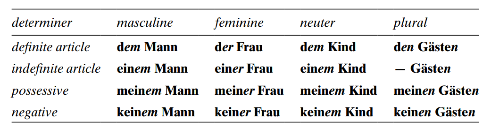
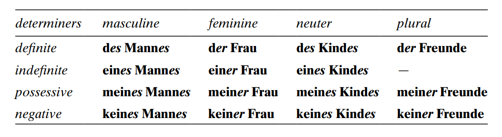
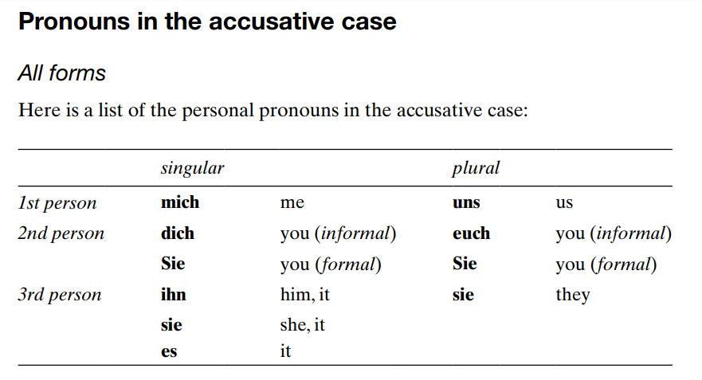
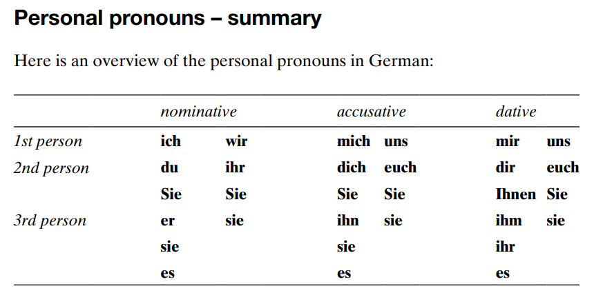
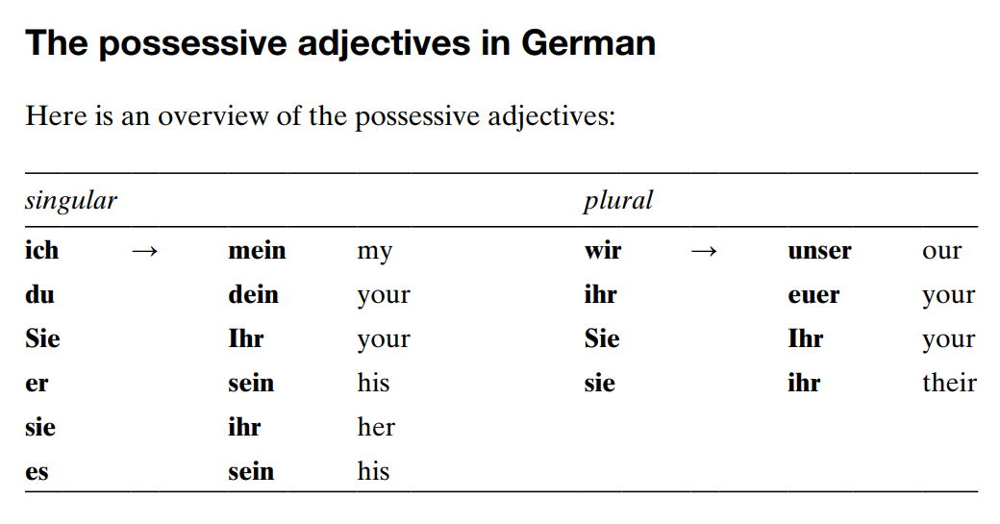
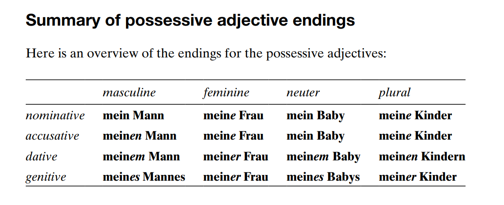

%Basic German 
%mzrxa
&nbsp;  

## Unit 3: Ver variations and irregular verbs

ich -e  
du -st  
er/sie/est -t  
wir -en  
ihr -t  
Sie -en  
sie -en  

### Exercise 3.1

**Arbeiten**  
ich arbeite  
du arbeitest  
Sie arbeiten  
er/sie/est arbeitet  
wir arbeiten  
ihr arbeitet  
Sie arbeiten  
sie arbeiten  

**Tanzen**  
ich tanze  
du tanzt  
Sie tanzen  
er/sie/es tanzt  
wir tanzen  
ihr tanzt  
Sie tanzen  
sie tanzen  

**Heissen**
ich heisse  
du heisst  
Sie heissen  
er/sie/es heisst  
wir heissen  
ihr heisst  
Sie heissen  
sie heissen  

**Reissen**
ich reise  
du reist  
Sie reisen  
er/sie/es reist  
wir reisen  
ihr reist  
Sie reisen  
sie resit  

**Googeln**  
ich goggle  
du googelst  
Sie googeln  
er/sie/es googelt  
wir googeln  
ihr googelt  
Sie googeln  
sie googelt  

### Exercise 3.2  

|Verb   |mark|Verb  |mark|Verb   |mark|Verb  |mark|
|:-----:|:--:|:----:|:--:|:-----:|:--:|:----:|:--:|
|bleiben|    |helfen| y  |schreiben|- |stehen|    |
|essen  |  y |kommen|    |schwimmen|  |tragen| y  |
|fahren |y   |nehmen|y   |sehen    | y|treffen| y-|
|geben  |y-  |lesen |y   |singen|  |trinken|y     |
|gehen  |    |schlafen|y |sprechen|y|waschen|  y- |

### Exercise 3.3  

1. Ich heisse Hans Homann. &rarr; Er heisst Hans Homann.
2. Ich komme aus Wien. &rarr; Er kommt aus Wien.
3. Ich arbeite bei Radio O24. &rarr; Er arbeitet bei Radio O24.
4. Ich esse zu Mittag meistens Sushi. &rarr; Er isst zu Mittag meistens Sushi.
5. Ich spreche natürlich Deutsch, aber auch Englisch und Spanisch. &rarr; Er spricht natürlich Deutsch, aber auch Englisch und Spanisch.
6. Ich lese gern Kriminalromane. &rarr; Er liest gern Kriminalromane.
7. Ich fahre auch gern Ski und schwimme viel. &rarr; Er fahrt auch gern Ski und schwimme viel.
8. Ich sehe gern Filme mit Michael Keaton. &rarr; Er sieht gern Filme mit Michael Keaton.
9. Ich schlafe oft lange. &rarr; Er schlaft oft lange.
10. Ich reise gern. &rarr; Er risst gerne.
11. Am Abend treffe ich oft Freunde im Kaffeehaus. &rarr; Am Abend trifft er oft Freunde im Kaffeehaus.
12. Am Wochenende helfe ich manchmal alten Leuten. &rarr; Am Wochenenden halft er manchmal alten Leuten.

### Exercise 3.4

1. She reads a book. &rarr; Sie liest ein Buch.
2. Peter speaks German and English. &rarr; Peter spricht Deutsch und Englisch.
3. We speak German and Spanish. &rarr; Wir sprachen Deutsch und Spanisch.
4. Magda likes eating pizza. &rarr; Magda möchte pizza essen.
5. I am meeting Nadine. &rarr; Ich treffe Nadine.
6. She is taking the underground. &rarr; Sie nimmt der untergrund.
7. He is wearing a T-shirt. &rarr; Er tragt ein T-shirt.

&nbsp;

## Unit 4: Irregular verbs: **haben** and **sein**

&nbsp;

### Summary

|       |haben  |sein   |
|:------|:-----:|:-----:|
|ich    |habe   |bin    |
|du     |hast   |bist   |
|Sie    |haben  |sind   |
|er/sie/es|hat  |ist    |
|wir    |haben  |sind   |
|ihr    |habt   |seid   |
|Sie    |haben  |sind   |
|sie    |haben  |sind   |

Ich haben viel gesunden &rarr; *I have sung a lot*  
Hunger haben &rarr; to be hungry &rarr; Ich habe Hunger.  
Durst haben &rarr; to be thirsty &rarr; Er hat Durst.  
Zeit haben &rarr; to be free/have time &rarr; Du hast Zeit.  
Glück haben &rarr; to be lucky &rarr; Sie haben Glück.  
Langeweile haben &rarr; to be bored &rarr; Wir haben Langeweile.  
Kopfschmerzen haben &rarr; to have a headache &rarr; Sie hat Kopfschmerzen.  

&nbsp;

### Exercise 4.1

&nbsp;

1. Hast du heute Abend Zeit?
2. Wir haben neue Nachbarn.
3. Er hat eine Schwester und einen Bruder.
4. Habt ihr etwas Geld?
5. Nadine hat ein neues Tablet.
6. Haben Sie ein Zimmer frei?
7. Ich habe Hunger.
8. Susanne und Frank ~~hat~~ haben eine neue Wohnung.

&nbsp;

### Exercise 4.2

&nbsp;

1. Sind Sie Engländer?          - Nein, ich bin aus Australien.
2. Bist du aus Deutschland?     - Ja, ich komme aus der Nähe bon Bonn.
3. Seid ihr aus München?        - Nein, wir sind aus Nürnberg.
4. Was ist Nele von Beruf       - Sie ~~sind~~ ist Designerin.
5. Was ~~machen~~ sind Katrin und Jan - Beide sind Studenten.
6. Was sind deine Hobbys?       - Mein Hobbys sind Musik und Computerspiele.
7. Wo bist du geboren?          - Ich bin in Düsseldorf geboren.
8. Wo seid ihr geboren?         - Wir sind beide in den USA geboren.

&nbsp;

### Exercise 4.3

&nbsp;

ich habe, du hast, Sie haben, er/sie/es hat, wir haben, ihr habt, Sie haben, sie haben.

ich bin, du bist, Sie sind, er/sie/es ist, wir sind, ihr seid, Sie sind, sie sind.

&nbsp;

### Exercise 4.4

&nbsp;

1. Wir sind aus New York.
2. Sie sind aus Australia.
3. Mario ist aus München.
4. Sind Sie Herr Becker?
5. Er hat eine Schwester.
6. Hast du Zeit? - Haben Sie Zeit?
7. Sie sind Studenten.
8. Ich habe ein Tablet.
9. Es ist Schwer.
10. Bonn ist in Deutschland und Salzburg is in Österreich.

&nbsp;

## UNIT 5 - Separable verbs in the present tense

&nbsp;

### Summary

&nbsp;

abfahren	-	to leave\
abholen		-	to pick up\
abwaschen	-	to do the washing up\
anfangen	-	to start\
ankommen	-	to arrive\
anrufen		-	to phone\
aufhören	-	to stop\
aufräumen	-	to tidy up\
aufstehen	-	to get up\
ausgehen	-	to get out\
ausschalten	-	to switch off\
einkaufen	-	to go shopping\
einladen	-	to invite\
einschlafen	-	to fall asleep\
fernsehen	-	to watch television\
mitbringen	-	to bring along\
mitkommen	-	to come along\
mitmachen	-	to join in\
stattfinden	-	to take place\
vorbereiten	-	to prepare\
sich vorstellen	-	to introduce oneself\
zumachen	-	to close\

&nbsp;

**Prefixes go at the end**

*When a sentence consists of **two main clauses**, the split-off prefix goes to the end of the releveant clause. **Not necessarily at the end of the sentence***

- anfrufen &rarr;       Herr Lobo ruft seine Frau an.
- aufstehen &rarr;      Nico steht um fünf Uhr morgens auf.
- ausgehen &rarr;       Yasmin geht jeden Tag aus.
- gernsehen &rarr;      Die Kinden sehen nicht viel fern.
- einkaufen &rarr;      Er kauft im Supermarkt ein.
- stattfinden &rarr;    Das Meeting findet am Montag statt.

|*clause 1*|*clause2*|  |
|:---------|:--------|:--|
|Ich stehe auf| un dann früstücke ich| I get up and then I have breakfast.|
| | | |
|Herr Carlsen sieht fern| aber seine Kinder lesen.| Mr Carlsen is watching television, but his children are reading|

&nbsp;

**Herr Schuster *schläft* erst um Mitternacht *ein*, aber er *steht* schon um fünf Uhr *auf***

**Verbs can have more than one prefix**

anmachen - to turn/switch on\
aufmachen - to open\
ausmachen - to turn/switch off\ 
mitmachen - to join in\
nachmachen - to imitate\
saubermacher - to clean\
weitermachen - to continue\
zumachen - to close\

&nbsp;

common separable prefixes:
- **ab- an- auf- aus- ein- mit- nach- vor- zu- zurück-**

some inseparable prefixes:
- **be- er- ge- ver-**

&nbsp;

### Exercise 5.1

&nbsp;

1. Jens *steht* um hab acht Uhr *auf*.
2. Er *fängt* seine Arbeit um neun Uhr *an*.
3. Mittags *ruft* er seine Freundin *an*.
4. Er *druckt* am Nachmittag viele Dokumente *aus*.
5. Um siebzehn Uhr *hört* er mit seiner Arbeit *auf*.
6. Nach der Arbeit *kauft* er im Supermarkt *ein*.
7. Abends *sieht* er manchmal *fern*.
8. Am Wochenende *geht* er oft *aus*.
9. Er *schläft* meistens *ein*. 

&nbsp;

### Exercise 5.2

&nbsp;

|aufstehen|s|verlieren|i|abfahren|s|anrufen|s|
|:--------|-|:--------|-|:-------|-|:------|-|
|verkaufen|i|fernsehen|s|anhängen|s|stattfinden|s|
|einladen|s|mitkommen|s|bezahlen|i|erzählen|i|
|aufräumen|s|früstücken|i|einkaufen|s|besuchen|i| 

&nbsp;

### Exercise 5.3

&nbsp;

1. Herr und Frau Nowitzki *stehen* um sieben Uhr *auf*.
2. Die Kinder *räumen* ihr Zimmer *auf*.
3. Er *kauft* immer im Supermarkt *ein*.
4. Wir gehen ins Café. *Kommst* du *mit*?
5. Wann ~~?!!?!?!~~ findet statt.
6. Herr Beckmann liebt TV-Serien. Er *sieht* jeden Tag *fehr*.
7. Wann *fährt* der nächste Zug nach Hamburg *ab*?
8. Wir *laden* viele Gäste zu unserer Party *ein*.
9. Philip *hängt* eine Datei *an*.
10. Sie hat ein neues Smartphone und ~~*rufen*~~ ruft ihre Freundin *an*.

&nbsp;

### Exercise 5.4

&nbsp;

1. Ich stehe um sechs Uhr auf.
2. Ich fange meine arbeit um acht Uhr an.
3. Das Treffen findet am Montag statt.
4. Wann fährt der Zug ab?
5. Wann kommt der Zug an?
6. Die Kinder sehen ~~fehr~~ fern.
7. Kommst du ~~an~~ mit?
8. Ich ~~stecke~~ hänge die Datei an und drucke ~~die~~ den Artikel auf.

### Checklist:

1. The first part the prefix
2. It goes to the very end of a sentence or clause
3. Seperable prefixes incluse ab-, an-, auf-, aus-, ein-, fern, mit-, statt-, vor-, zu-
4. In a good conventional dictionary it should say 'sep' after the main German entry
5. Non-separable prefixes include be-, er-, ge-, ven-

&nbsp;

## Unit 6 - Imperatives

&nbsp;

### Summary

&nbsp;

1. Du form:
    - stem of the verb without ending: komm-en &rarr; komm. Komm her!
    - irregular (du) form:
        - if stem end -d, -t, consonant+m or consonant+n add -e: warten &rarr; wart(+ -e) Warte!
        - stem vowel change = same vowel change in imp: sprechen &rarr; sprich. Sprich leise!
        - stem vowel change a to ä: do not change (use stem): fahren &rarr; fahr. Fahr rechts!
    - separable verbs:
        - prefix after the verb or end of clause: mitmmachen &rarr; mach...mit &rarr; Mach bitte mit.
    - haben and sein:
        - like regular verbs, form from the stem: hab-en &rarr; hab. Hab Geduld. Be patient. sei-n &rarr; sei. Sei vorichtig. Be careful.
2. One person formal - Sie form:
    - just use the infinitive (with Sie after verb): kommen &rarr; Kommen Sie, bitte.
    - separable verbs:
        - verbs split as before: anfangen &rarr; Fangen Sie bitte an. Please start.
    - haben and sein:
        - just infinitive, but extra e with **sein**: haben &rarr; Hbaen Sie Geduld (be patient). sein &rarr; Seien Sie vorsichtig (be careful).
3. More than one informally - Ihr form:
    - add -t to stem: also for haben:
        - even if -e because stem end -d, -t, consonant+m or consonant+n, add -t (-et)
        - sein &rarr; seid
        - separate verbs split prefix
4. More than one person formal - Sie form:
    - exactly like Sie singular

&nbsp;

### Exercise 6.1

1. Bringen Sie mir noch einen Safat, bitte.
2. Öffnen Sie bitte das Fenster.
3. Warten Sie bitte noch fünf Minuten.
4. Schicken Sie mir eine SMS.
5. Kommen Sie herein!
6. Fangen Sie an!
7. Seine Sie bitte ruhig. 
8. Haben Sie ein bisschen Geduld.

&nbsp;

### Exercise 6.2

&nbsp;

1. Bring du mir noch einen Safat, bitte.
2. Öffne du bitte das Fenster.
3. Warte du bitte noch fünf Minuten.
4. Schicke du mir eine SMS.
5. Komme du herein!
6. Fange du an!
7. Sei du bitte ruhig. 
8. Habe du ein bisschen Geduld.

&nbsp;

### Exercise 6.3

&nbsp;

1. Fahr mit dem Fahrrad.
2. Geh zu einem Yogakurs.
3. Sieh weniger fern. 
4. Ess meh Gemüse.
5. Lies einen Blog über Gesundheit.
6. Schläf mehr.
7. Sei relaxter.
8. Geh meh aus.
9. Finde eine bessere Work-Life-Balance.

&nbsp;

### Exercise 6.3

&nbsp;

1. Please start
    - Geh bitte aus
    - Gehen Sie bitte aus
    - Geht bitte aus
2. Open the window
    - Öff die fenster
    - Öffen Sie die fenster
    - Öfft die fenster
3. Send me a text message
    - Schick mir eine SMS 
    - Schicken Sie mir eine SMS
    - Schickt mir eine SMS
4. Be careful
    - Hab vorsichtig
    - Sei Sie vorsichtig
    - Seid vorsichtig

&nbsp;

### Checklist

&nbsp;

1. Du, Sie (one pers form), Ihr, Sie (multi form)
2. By removing the -en from the stem
3. Vowel change. Separable. Added -e?
4. !

&nbsp;

## Unit 7 - Questions

&nbsp;

### Summary

1. Wh-question: Woher kommen Sie?
    - wo? where
    - woher? where from
    - wohin? where to
    - wann? when
    - wie? how/what
    - wie lange? how long
    - wie viel? how much
    - wie viele? how many
    - wie oft? how often
    - warum? why
2. Y/N question: Ist das Ihr handy?

- wie for names and addresses

&nbsp;

### Exercise 7.1

&nbsp;

1. Wie heißen Sie?
2. Wo wohnen Sie?
3. Wie ist Ihre E-Mail-Adresse?
4. Wo arbeiten Sie?
5. ~~Wie~~ Was sind Sie von Beruf?
6. ~~Wo~~ Woher kommen Sie eigentlich?
7. Wie viel kostet das?
8. Wann beginnt der Workshop?
9. Wie viel Uhr ist es?
10. ~~Wann~~ Woher kommt der Tennisspieler?
11. Wohin fahren wir am Sonntag?
12. Wie viele Einwohner hat Deutschland?

&nbsp;

### Exercise 7.2

&nbsp;

1. Ist das Restaurant wirklich sehr billig?
2. Ist Leon wirklich verheiratet?
3. Macht Frau Weber wirklich viel Sport?
4. Kostet Das Smartphone wirklich nur 80 Euro?
5. Stehen Jennifer und Max wirklich um sechs Uhr auf?

&nbsp;

### Exercise 7.3

&nbsp;

1. ~~Wie heißt du?~~ Wie ist Ihr Name?
2. Was sind Sie von Beruf?
3. ~~Wann Sie die Arbeit anfangen?~~ Wann beginnt Ihre Arbeit?
4. ~~Möchten Sie die Arbeit?~~ Ist die Arbeit interessant?
5. Haben Sie Kinder?
6. Sind Sie verheiratet?
7. ~~Haben Sie Hobbys?~~ Was sind Ihre Hobby? 
8. Sprechen Sie Spanisch?

&nbsp;

### Exercise 7.4

&nbsp;

1. Was ist dein Name?
2. Woher kommst du?
3. Wie ist deine email address?
4. Wie spät ist es?
5. Bist du verheiratet?
6. Hast du Kinder?
7. Sprichst du Englisch?
8. Was magst du von Beruf?

&nbsp;

### Exercise 7.4

&nbsp;

1. Wie
2. First position
3. Second?
4. Woher Wohin

&nbsp;

## Unit 8 - Articles

&nbsp;

### Exercise 8.1

&nbsp;

1. Die Frau kommt aus Brasilien.
2. Die Idee ist wirklich gut.
3. Wie heißt der Junge.
4. Der Mann von Elena ist aus München.
5. Das Handy ist teuer.
6. Ist dies das Kind von Tim?
7. Der Sommer ist jetzt zu Ende.
8. Die Türkei ist schön.
10. Was machen das Kinder.

&nbsp;

### Exercise 8.2

&nbsp;

Der die das die ein eine ein -

&nbsp;

### Exercise 8.3

&nbsp;

1. Der Kaffee ist stark.
2. Das ist ein neues Computerspiel.
3. Canberra ist die Hauptstadt von Australien.
4. Ich möchte ein Bier und eine Cola, bitte.
5. Hannover ist die Stadt in Deutschland.
6. Das Restaurant ist sehr gut.

&nbsp;

### Exercise 8.4

&nbsp;

1. Die Frau kommt aus Berlin.
2. Der Kaffee ist lecker.
3. Das Kind ist sieben Jahre alt.
4. Die Kinder spielen Fußball.
5. Er ist Amerikaner.
6. Er ist ein Lehrer.
7. Das ist Die Brandenburg Tor. 
8. Frühling war Kalt.i

&nbsp;

## UNIT 9 - Nouns and Gender

&nbsp;

### Exercise 9.1

&nbsp;

1. Der Montag, Dienstag, Mittwoch, Sonntag
2. Der Audi, Ferrari, Nissan, Ford
3. Das Silber, Gold, Eisen, Kupfer
4. Die Rose, Tulpe, Sonnenblume
5. Die Tochter, Schwester, Mutter, Cousine
6. Der Sommer, Frühling, Herbst, Winter
7. Der Wodka, Champagner, Rotwein, Schnaps
8. Das Schwimmen, Essen, Tanzen, Joggen

&nbsp;

### Exercise 9.2

&nbsp;

|Noun|Gender|Noun|Gender|Noun|Gender|Noun|Gender|
|-|-|-|-|-|-|-|-|
|Bäckerei|f|Auto|n|Flasche|f|Temperatur|f|
|Lampe|f|Märchen|n|Metzgerei|f|Museum|n|
|Kirche|f|Emigration|f|Zentrum|n|Religion|f|
|Liberalismus|m|Nation|f|Demokratie|f|Instrument|n|
|Zeitung|f|Kino|n|Büro|n|Potenzial|n|
|Meinung|f|Honig|m|Universität|f|Motor|m|
|Karte|f|Optimismus|m|Mädchen|n|Natur|f|

&nbsp;

1. masculine:
    - male persons
    - days months
    - seasons
    - makers of cars
    - alcoholic drinks
2. feminine:
    - female persons
    - trees and flowers
    - names of motorbikes and ships
3. neuter:
    - young persons
    - names of hotels and cinemas
    - most metals
    - infinitives as nouns

&nbsp;

### Exercise 9.3

&nbsp;

1. Berlin ist eine fantastische Stadt
2. Das Hotel liegt sehr zentral.
3. Der Service ist ausgezeichnet und das Essen ist gut.
4. Die Woche geht so schnell vorbei.
5. Die Menschen in Berlin sind sehr freundlich.
6. Heute Abend gehen wir zuerst in ein Konzert und dann in ein Restaurant und feiern unseren letzten Tag in Berlin.
  
&nbsp;

### Exercise 9.4

&nbsp;

1. Das E Auto fährt sehr ökologisch.
2. Der Tisch und das Regal sind kaputt.
3. Die Tochter heißt Marina.
4. Die Rose ist sehr schön.
5. Die Karte kostet 10 Euro.
6. Die Jacke ist von Chanel.
7. Das Bier ist alkoholfrei.
8. Das Stadtzentrum ist sehr alt.
9. Ist der VW neu?
10. Das Mädchen ist elf Jahre alt und der Junge ist sieben.
11. Die Internetverbindung ist sehr langsam.
12. Die Grammatik ist manchmal schwer.

&nbsp;

## UNIT 10 - Plural of noun

&nbsp;

### Exercise 10.1

&nbsp;

1. die Messer
2. die Mäntel
3. die Bücher
4. die Kühlschränke
5. die Gläser
6. die Mütter
7. die Passwörter
8. die Regale
9. die Tassen
10. die Teppiche
11. die Zeitungen
12. die Zimmer

&nbsp;

### Exercise 10.2

&nbsp;

1. Die Tage
2. Die Kurse
3. Die Orangensäfte
4. Die Gäste
5. Die Schnäpse
6. Die Tassen
7. Die Meinungen
8. Die Städte
9. Die Bratwürste
10. Die Schiffe
11. Die Programme
12. Die Häuser
13. Die Bücher
14. Die Länder
15. Die Tomaten
16. Die Hotels
17. Die Blogs
18. Die Handys
19. Die Tweets
20. Die Sneakers

&nbsp;

### Exercise 10.3

&nbsp;

1. Masculine:
    . -e 
    . Umlaut +e
    . Some without ending
2. Feminine:
    . -en -n and sometimes -e 
    . Umlaut +e 
    . Some without ending
3. Neuter:
    . Umlaut +er
4. Foreign:
    . -s

&nbsp;

### Exercise 10.4

&nbsp;

1. Ich möchte zwei Flaschen, Bitte.
2. Zwei Würste, Bitte.
3. Die Äpfel sind zu süß.
4. Er hat zwei Schwestern und drei Brüder.
5. Sie liest drei Zeitungen.
6. Das Haus hat vier Zimmer.
7. Sie spricht fünf Sprachen.
8. Die Hause sind neu. 
9. Er hat drei Handys.
10. Die Partys sind immer interessant.

## UNIT 11 - The Four Case

&nbsp;

### Exercise 11.1

&nbsp;

. <ins>subject</ins>
. **accusative**
. _dative_ 

1. <ins>Der Mann</ins> geht ins Fitnesscenter.
2. <ins>Er</ins> kauft dem Mädchen ein Eis.
3. <ins>Herr Schulz</ins> zeigt dem Gast den Garten.
4. <ins>Der Kellner</ins> bringt dem Mann das Essen. 
5. Um acht Uhr verlässt <ins>die Nachbarin</ins> das Haus.
6. Nach dem Essen trinken <ins>die Leute</ins> noch Kaffee. 

&nbsp;

### Exercise 11.2

&nbsp;

1. Ich schenke _der Frau_ **ein Buch**.
2. Er kauft _dem Mädchen_ **ein Eid**.
3. Herr Schulz zeigt _dem Gast_ **den Garten**
4. Der Kellner bringt _dem Mann_ **das Essen**.

&nbsp;

### exercise 11.3

&nbsp;

||accusative||dative||genitive||
|-|-|-|-|-|-|-|-|
|masculine|einen|y|einem|y|eines|y|
|feminine|eine|n|einer|y|einer|y|
|neuter|ein|n|einem|y|einem|y|

&nbsp;

||accusative||dative||genitive||
|-|-|-|-|-|-|-|-|
|masculine|den|y|dem|y|des|y|
|feminine|die|n|der|y|der|y|
|neuter|das|n|dem|y|des|y|

&nbsp;

## UNIT 12 - The Nominative Case

&nbsp;

NB: Seinen and werden take the nominative too: Es wird **ein** schöner Tag.

&nbsp;

### Exercise 12.1

&nbsp;

1. Dies ist ein LED Fernseher. Der LED Fernseher kostet 400 Euro.
2. Dies ist ein  Auto. Das Auto ist ein VW.
3. Dies ist eine Zeitung. Die Zeitung heißt Die Welt.
4. Dies ist eine Flasche Bier. Die Flasche kommt aus München.
5. Dies ist ein Hotel. Das Hotel heißt Maritim.
6. Dies ist ein Supermarkt. Der Supermarkt heißt Aldi.
7. Dies sind Studenten. Die Studenten kommen aus Kanada.
8. Dies sind Trainers. Die Trainers sind neu.

&nbsp;

### Exercise 12.3

&nbsp;

1. Dies ist ein Haus.
2. Das Haus ist sehr alt.
3. Der Mann heißt Mario.

&nbsp;

## UNIT 13 - The Accusative Case

&nbsp;

. after most verbs
. after these prepositions:
    . bis until
    . durch through
    . für for
    . gegen 
    . ohne without
    . um 

&nbsp;

### Exercise 13.1

&nbsp;

1. ich brauche eine Lampe.
2. ich brauche eine Blumenvase.
3. ich brauche einen Küchentisch.
4. ich brauche ein Sofa.
5. ich brauche ein Bücherregal.
6. ich brauche einen Teppich.
7. ich brauche einen Kühlschrank.
8. ich brauche eine Mikrowelle.
9. ich brauche eine Kaffeemaschine.
10. ich brauche eine Waschmaschine.
11. ich brauche ein Handy.
12. ich brauche einen Camcorder.

&nbsp;

### Exercise 13.2

&nbsp;

1. Das Buch ist für einen Freund.
2. Das Sweatshirt ist für eine Freundin.
3. Die Sportschuhe sind für meine Schwester.
4. Die Socken sind für meinen Vater.
5. Die Lego-Spiele sind für das Kind.
6. Er ist gegen die Idee.
7. Ohne der Hund möchte er nicht in den Urlaub fahren.
8. Er möchte um das ganze Welt fahren.

&nbsp;

### Exercise 13.3

&nbsp;

1. Ich möchte einen Kaffee.
2. Der Mann kauft den Computer.
3. Die Frau kauft den Camcorder.
4. Das Kind liest das Buch.
5. Das Sweatshirt ist für mein Bruder.
6. Das Buch ist für meine Schwester.
7. Wir gehen durch den Park.
8. Ich brauche eine Kaffeemaschine und eine Mikrowelle.
9. Ich brauche einen Regenschirm.
10. Ich bin für die Idee.

&nbsp;

## UNIT 14 - The Dative Case

&nbsp;

&nbsp;

- dem der dem den 
- einem einer einem 
- meinem meiner meinem meinen
- keinem keiner keinem keinen

- antworten
- begegnen, to encounter
- helfen
- danken
- gehören, to belong to
- gratulieren
- folge, to follow
- trauen, to trust

- aus, from. Er kommt aus der Turkei.
- außer, apart from
- bei, at neat
- gegenüber, opposite. Er wohnt gegenüber der Kirche.
- mit, with by. Ich fahre mit dem Bus.
- nach, after to. Nach der Arbeit gehe ich einkaufen.
- seit, since for. Tim studiert seit einem Jahr.
- von, from
- zu, to. Wir fahren zu meiner Freundin.

&nbsp;

### Exercise 14.1

&nbsp;

1. Sie gibt dem Großvater ein Buch über Nelson Mandela.
2. Sie gibt der Mutter einen Strauß Blumen.
3. Sie gibt dem Vater eine Flasche Wein.
4. Sie gibt dem Sohn Star-Wars-Tasse.
5. Sie gibt der Tochter ein Haarband.
6. Sie gibt dem Baby einen Ball.

&nbsp;

### Exercise 14.2

&nbsp;

1. Er fährt jeden Tag mit dem Auto.
2. Gegenüber dem Rathaus ist der Stadtpark.
3. Sie kommt gerade aus der Stadt.
4. Den neuen Shop gibt es seit einem Jahr.
5. Vor einer Woche hat sie geheiratet,
6. Was machst du heute nach der Arbeit.
7. Sie wohnt bei dem Freund.
8. Er telefoniert mit dem Handy.
9. Sie hilft der Frau.
10. Das gehört dem Mann.
11. Er dankt den 20 Mitarbeitern.
12. Wir helfen den Kindern.

&nbsp;

### Exercise 14.3

&nbsp;

1. Sie gibt dem Baby ein Buch.
2. Paulina kauft dem Kind ein Eis.
3. Er gibt dem Großvater eine Flasche Wein.
4. Er folgt dem Mann.
5. Das iPad gehört dem Fahrer.
6. Peter hilft dem Mädchen.
7. Er gibt dem Kinder einen Ball.
8. Sie kommmt aus der Turkei.

&nbsp;

## UNIT 15 - The Genetive Case

&nbsp;

- masculine and neuter -es
- feminine -er
- one-syllable neuter and masculine nouns -es, longer ones add -s

- trotz, despite
- während, during
- wegen, because of
- (an)statt, instead of 

- Während seiner Zeit... During this time...
- Trotz ihres jungen Alters... Despite her young age...

&nbsp;

### Exercise 15.1

&nbsp;

1. Das ist das Mountainbike von meinem Sohn.
2. Das sind die Sportsachen von meiner Frau.
3. Das ist das Spielzeug von meinemm Kind.
4. Das ist die Frau von meinem Chef.
5. Da vorne steht der Scooter von meiner Schwester.
6. Die Lehrerin von der Englischkurse kommt aus New York.
7. Der Trainer von unserer Hockeymannschaft ist sehr gut.
8. Die Meinung von meiner Freunde ist mir sehr wichtig.

&nbsp;

### Exercise 15.2

&nbsp;

1. Das ist der Scooter meines Bruders.
2. Das ist das Auto meiner Schwester.
3. Diese sind die Freunde meiner Tochter.
4. Das ist Paulas Tasche.
5. Es war Tims Fehlentwicklung.

&nbsp;

## Unit 16 - Personal Pronouns

&nbsp;

- durch, through
- für
- gegen
- ohne
- um, around

&nbsp;

- außer, apart from
- aus, from
- bei, at, near
- gegenüber, opposite
- mit
- nach, after, to
- set, since, for
- zu, to

- danken
- gehören, to belong to
- antworten
- helfen
- folgen, to follow

&nbsp;

- The pronoun "man" - 'one, you', refers to people in general: 
  	- Man tut das nicht. You don't do that. One does not do that.
	- Man darf hier nicht fotografieren. You are not allowed to take photographs here.

&nbsp;

&nbsp;

### Did you know?

- Wie geht es dir/Ihnen/euch?
- Es geht mir gut. I am well.
- Es tut mir leid. I am sorry.
- Meine Nase/Mein Bein tut mir weh. My nose/My leg hurts.
- Mir ist kalt/heiß. I am cold/hot.
- Gefält fir/Ihnen das T-Shirt? Do you like the T-shirt?
- Können Sie mir sagen, vieviel Uhr es ist? Can you tell me what time it is?

&nbsp;

### Exercise 16.1

&nbsp;

1. Er kommt aus Bremen.
2. Sie hat einen neuen Freund.
3. Es ist neu.
4. Sie spielen im Park Fußball.
5. Sie waren teuer.
6. Sie kostet 7.50 Euro.
7. Sie hat einen schlechten Tag.
8. Es heißt Lena.
9. Er ist Ingenieur von Beruf.
10. Sie machen Urlaub in einem Wellnesshotel.

&nbsp;

### Exercise 16.2

&nbsp;

1. Ja, ich kaufe es.
2. Ja, ich kenne ihn.
3. Ja, ich kenne sie.
4. Ja, ich habe es.
5. Ja, ich trinke ihn.
6. Ja, ich möchte sie.
7. Ja, ich mag sie.
8. Ja, ich besuche dich.
9. Ja, ich besuch euch.
10. Ja, es geh mir gut.

&nbsp;

### Exercise 16.3

&nbsp;

1. Schenkst du Tina etwas? - Ja, ich schenke ihr Blumen.
2. Gefällt dir die Party? - Nein, die Party gefällt mir überhaupt nicht.
3. Kaufst du Matthias ein T-Shirt? - Nein, ich kaufe ihm eine Baseballmütze.
4. Hilfst du den Kindern? - Ja, ich helfe ihnen.
5. Kannst du mir helfen? - Ja, ich helfe dir.
6. Können Sie mir helfen? - Ja, ich helfe Ihnen.
7. Gehört das Ihnen? - Ja, es gehört mir.
8. Was bringst du denn Anna und Tina mit? - Ich kaufe ihnen eine Flasche Wein. 
9. Soll ich euch die Wohnung zeigen? - Ja, zeig sie uns, bitte.
10. Schickst du uns ein Selfie aus dem Urlaub? - Ja, ich schicke euch ein Selfie.

&nbsp;

### Exercise 16.4

&nbsp;

1. Der Kaffee ist gut. Es ist gut.
2. Die Jacke ist neu. Sie ist neu.
3. Ist es für mich?
4. Ich kaufe ihm eine Flasche Wein.
5. Er schickt ihr ein SMS.
6. Wie geht es dir? Wie geht es Ihnen.
7. Mir geht es gut.
8. Es tut mir leid.

&nbsp;

## Unit 17 - Possesive Adjective

&nbsp;

&nbsp;

### Exercise 17.1

&nbsp;

- my mein
- your (informal) dein
- your (formal) Ihr
- his sein
- her ihr
- its sein
- our unser
- your (informal) euer
- your (formal) Ihr
- their ihr

&nbsp;

### Exercise 17.2

&nbsp;

1. Wie ist dein Name? - Mein Name ist Frank Auerbach.
2. Wie ist deine Telefonnummer? - Meine Telefonnummer ist 888888.
3. Ist das sein Auto? - Nein, das ist ihr Auto.
4. Was sind Ihre Hobbys? - Meine Hobbys sind Joggen und Skifahren.
5. Was sind euer Namen? - Unsere Namen sind Svenja und Boris.
6. Sind das eure Sportsachen? - Ja, das sind unsere Sportsachen.

&nbsp;

### Exercise 17.3

&nbsp;

1. Tom sucht seine Brille.
2. Paula sucht ihr Geld.
3. Mehmet sucht seinen Controllen.
4. Marion sucht ihren Schal.
5. Martha sucht ihre SIM-Karte.
6. Benjamin sucht sein I-Pad.
7. Peter such seine Schuhe.
8. Jessica und Pia suchen ihre Pässe.

&nbsp;

### Exercise 17.4

&nbsp;

1. Das ist mein Vater.
2. Das ist meine Mutter.
3. Marc sucht seine SIM-Karte.
4. Susanne sucht ihren Führerschein.
5. Wir treffen unsere Freunde.
6. Sebastian spricht mit seiner Mutter.
7. Arianne spricht mit ihrem Bruder.
8. Die Kinder sprachen mit ihren Großeltern.

&nbsp;

## Unit 18 - Reflexive Verbs

&nbsp;

- sich amüsieren
- sich anziehen - to get dressed
- sich ärgern - to get or to be annoyed
- sich ausziehen - to get undressed
- sich bedanken - to say thank you
- sich beeilen - to hurry (up)
- sich duschen - to shower
- sich entscheiden - to decide
- sich entschuldigen - to apologise
- sich kämmen - to comb one's hair
- sich rasieren - to shave
- sich schminken - to put makeup
- sich setzen - to sit down
- sich treffen - to meet
- sich umziehen - to get changed
- sich unterhalten - to talk, chat
- sich verabschieden - to say goodbye
- sich vortsellen - to introduce onseself
- sich waschen - to wash oneself to have a wash

### Reflexive Pronouns - Akk

mich, dich, sich, uns, euch, sich

- Ich wasche mich
- Du wäschst dich
- Sie waschen sich
- er/sie/es Wäscht sich
- Wir waschen uns
- Ihr wascht euch
- Sie waschen sich
- Sie waschen sich

### Reflexive Pronouns (dativ)

- sometimes the pronoun is indirect object:
	- like when saying what clothes you are putting on
	- Ich ziehe mich an &rarr; Ich ziehe mir eine Jacke an
- only dativ example:
	- sich überlegen: to think something over
	- sich vornehmen: to intend to do
- pronouns dativ example:
	- Ich wasche mir die Haare
	- Du wäschst dir die Haare
	- Sie waschen sich die Haare
	- Er/Sie/Es wäscht sich die Haare
	- Wir waschen uns die Haare
	- Ihr wascht euch die Haare
	- Sie waschen sich die Haare
	- Sie waschen sich die Haare
- Sich,uns and euch are the same in dative and accusative
- Mich/Mir Dich/Dir differ

### Separable verbs

- When a verb is separable, the pronoouon tends to follow the ver and the prefix goes to the end of the sentence or the main clause:
	- anziehen &rarr; Ich ziehe mich an.
	- vorstellen &rarr; Er stellt sich dem Publikum vor. He introduces himself to the audience.

### Reflexive and non-reflexive verbs

- most can be used as non reflexive:
	- Ich wasche das Auto
	- Ich wasche mich
- Some only reflexive:
	- sich beeilen
	- sich bedanken

### Useful Expressions

- Wasch dir die Hände!		Wash your hands!
- Ich putze mir die Zähne.	I brush my teeth.
- Er putzt sich die Nase.	He blows his nose.
- Sie schminkt sich.		She puts on her make-up

### Exercise 18.1

&nbsp;

| amusieren | r | beeilen  | r | entscheiden   | r | einkaufen   | n |
| anziehen  | r | sudieren | n | entschuldigen | r | tanzen      | n |
| ausgehen  | n | duschen  | r | fahren        | n | unterhalten | r |
| ausziehen | n | arbeiten | n | kämmen        | r | waschen     | r |

&nbsp;

### Exercise 18.2

&nbsp;

1. Er entschuldigt sich bei seiner Freundin.
2. Das Kind kämmt sich nicht gern.
3. Ich ärgere mich über die Preise.
4. Ich ziehe mich um.
5. Anne zieht sich neues Kleid an.
6. Die Kinder waschen sich.
7. Die Spieler duschen sich nach dem Spiel.
8. Wir beeilen uns.
9. Wir treffen uns um acht Uhr.
10. Wir verabschieden uns.

&nbsp;

### Exercise 18.3

&nbsp;

1. Ich wasche mir die Hände.
2. Putzt du dir heute nicht die Zähne?
3. Zieh sich etwas Warmes an. Es ist kalt.
4. Ich wasche mir das Gesicht nur mit Wasser.

&nbsp;

### Exercise 18.4

&nbsp;

1. Ich dusche mich.
2. Ich putze mir die Zähne.
3. Ich ziehe mich an.
4. Ich kämme mich.
5. Ich ziehe mir eine Jacke.
6. Ich beeile mich.

&nbsp;

## UNIT 19 - Negatives

&nbsp;

### Exercise 19.1 

&nbsp;

1. Franziska joggt nicht.
2. Mario ist nicht clever.
3. Der film ist nicht interessant.
4. Das Wetter in England ist nicht gut.
5. Er fotografiert nicht gern.
6. Nadine macht nicht gern Outdoorsport.
7. Er fährt nicht gern mit seinem Mountainbike.
8. Monica kommt nicht aus Österreich.
9. Er ist nicht verheiratet.
10. Mia studiert nicht Medizin.
11. Sie geht heyte nicht ins Konzert.
12. Er spielt nicht gut Klavier.
13. Ich habe die App nicht gekauft.
14. Er hat die E-Mail nicht gelesen.

&nbsp;

### exercise 19.2

&nbsp;

1. Das Team hat kein Glück.
2. Sie hat keine Geduld.
3. Er hat im Moment kein Geld.
4. Elena hat keinen Bruder.
5. Ich habe keine Zeit.
6. Das ist kein Problem.
7. Er ist Veganer und isst kein Fleisch.

&nbsp;

### exercise 19.3

&nbsp;

1. Ist das ein Park? &rarr; Nein, das ist kein Park.
2. Ist das eine Kneipe? &rarr; Nein, das ist keine Kneipe.
3. Hast du ein Auto? &rarr; Nein, ich habe kein Auto.
4. Möchtest du einen Kaffee? &rarr; Nein ich möchte keinen Kaffee.
5. Nein, ich nehme keinen Nachtisch.
6. Nein, sie hat keine Schwester.
7. Nein, es hat keinen Wellnessbereich.
8. Nein, ich habe keine Geschwister.
9. Nein, ich habe keine Wanderschuhe.
10. Nein, Freiburg hat keine U-Bahn.
11. Nein, ich habe keine Zeit.

&nbsp;

### exercise 19.4

&nbsp;

1. Luke doesn't work. &rarr; Luke arbeitet nicht.
2. The hotel is not beautiful. &rarr; Das hotel ist nicht schön.
3. The tablet is not cheap. &rarr; Die Tablet ist nicht billig.
4. Paul doesn't have a mountain bike. &rarr; Paul hat kein Mountainbike.
5. They don't have a car. &rarr; Sie haben kein Auto.
6. This is not a good idea. &rarr; Das ist nicht eine gute Idee.
7. He hasn't got any time. &rarr; Er hat keine Zeit.
8. She doesn't live in London, but in New York. &rarr; Sie wohnt nicht in London, sondern in New York.
9. I don't drink coffee, but tea. &rarr; Ich trinke keinen Kaffee, Sondern Tee.
10. This is not a problem. &rarr; Das ist kein Problem.

&nbsp;

## UNIT 20 - Comparison of adjectives and adverbs

&nbsp;

### Summary

&nbsp;

- Comparative: Bigger, cheaper, more expensive
- Superlative: Biggest, cheapest, most expensive

- English comparative: -er or "more"
- English superlative: "the" -est or "the most"

#### Formation in German

- German comparative: add -er to the basic form (regardless of how long the adjective is):
	- billig	&rarr;		Dieser Laptop ist billiger
	- interessant 	&rarr;		London ist viel interessanter als Paris

- German superlative: add -sten to the adjective and put "am" before it, if the superlative comes after a noun:
	- billig	&rarr; 		Dieser Laptop ist am billigsten

#### The comparative in detail

- Adding -er:
	- klein		&rarr;		kleiner
	- cool		&rarr;		cooler
	- schnell	&rarr;		schneller
	- hässlich	&rarr;		hässlicher
	- langweilig	&rarr;		langweiliger
	- ökologisch	&rarr;		öokologischer
- Adding umlaut + -er:
- most short adjectives with the stem vowel a, o or u also add an umlaut
	- alt		&rarr;		älter
	- arm [poor]	&rarr;		ärmer
	- jung		&rarr;		jünger
	- groß		&rarr;		größer
	- kalt		&rarr;		kälter
	- lang		&rarr;		länger
	- stark [strong] &rarr;		stärker
	- warm		&rarr;		wärmer;
	- Exception:
		- flach		&rarr;		flacher
		- klar		&rarr;		klarer
		- voll		&rarr;		voller
		- gesund	&rarr;		gesünder
- Irregular forms:
	- gut		&rarr;		besser
	- hoch		&rarr;		höher
	- if -er -el drop e in comparative:
		- teuer		&rarr;		teurer
		- dunkel	&rarr;		dunkler
- Hoow to say 'than' als:
	- Berlin ist größer als München
	- Der Rhein ist länger als die Donau

#### The superlative in more detail

- Adding -sten:
	- The superlative is formed by adding -sten preceded by am
	- klein		&rarr;		am kleinsten
	- cool		&rarr;		am coolsten
	- schnell	&rarr;		am schnellsten
	- hässlich	&rarr;		am hässlichsten
	- langweilig	&rarr;		am langweiligsten
	- ökologisch	&rarr;		am ökologischsten
- Adding umlaut + -sten:
	- most monosyllabic adjectives with stem vowel a, o, u add umlaut
	- jung		&rarr;		am jüngsten
	- groß		&rarr;		am größten
	- lang		&rarr;		am längsten
	- warm		&rarr;		am wärmsten
	- Exception:
		- flach		&rarr;		am flachsten
		- klar		&rarr;		am klarsten
		- voll		&rarr;		am vollsten
- Irregular forms:
	- gut		&rarr;		am besten
	- nah		&rarr;		am nächsten [the closest]
	- hoch		&rarr;		am höchsten
	- -er -el keep the e:
		- teuer		&rarr;		am teuersten
		- dunkel	&rarr;		am dinkelsten
- Adjectives ending in -d, -t, -s, -z:
	- usually add extra e before -sten
	- kalt		&rarr;		am kältesten
	- kurz		&rarr;		am kürzesten
	- gesund	&rarr;		am gesündesten
	- interessant	&rarr;		am interessantesten

#### Comparative and superlative with adverbs

- Adverbs in German:
	- In English add -ly beautifully
	- In German most have the same form as adjectives

- Hana läuft langsam. &rarr; Kira läuft langsamer. &rarr; Paula läuft am langsamsten.
- Timo singt schlecht. &rarr; Sascha singt schlechter. &rarr; Jan singt am schlechtesten.
- Das Hardcover kostet wenig. &rarr; Das Paperback kostet weniger. &rarr; Das E-Book kostet am wenigsten.

- Using gern and viel:
	- Ich trike gern Wasser. &rarr; Ich trinke lieber Kaffee. &rarr; Ich trinke am liebsten Bier.
	- Björn twittert viel. &rarr; Rania twittert mehr. &rarr; Axel twittert am meisten [the most].

- NB:
	- The examples in this unit relate to comparative and superlative forms FOLLOWING nouns. These forms may change endings when they appear BEFORE a noun.

- Did you know:
	- another way of making comparison "so ... wie" [as ... as]
	- Er ist so kalt wie gestern:
		- It is as cold as yesterday
	- Er ist so groß wie sein Bruder:
		- He is as tall as his brother
	- Der Film ist so gut wie das Buch:
		- The film is as good as the book

&nbsp;

### Exercise 20.1

&nbsp;

|                  | comparative         | superlative             |
|------------------|---------------------|-------------------------|
| klein            | kleiner             | am kleinsten            |
| langweilig       | langweiliger        | am langweiligsten       |
| alt              | älter               | am ältesten             |
| groß             | größer              | am größten              |
| hoch             | höher               | am höchsten             |
| interessant      | interessanter       | am interessantesten     |
| intelligent      | intelligenter       | am intelligentesten     |
| umweltfreundlich | umweltfreundlichter | am umweltfreundlichsten |
| gut              | besser              | am bestern              |
| gern             | lieber              | am liebsten             |
| viel             | mehr                | am miesten              |

&nbsp;

### Exercise 20.2

&nbsp;

1. Ist der Rhein wirklich länger als die Donau?
2. Norddeutschland ist flacher als Süddeutschland.
3. Der Zug ist billiger als das Flugzeug.
4. Ist das I-Pad teurer als das I-Phone?
5. Ich finde das Buch interessanter als den Film.
6. Die neue Castingshow ist langweiliger als die alte.
7. Auf dem Land ist es ruhiger als in der Stadt.
8. Heute ist es kälter als gestern.
9. Das neue Modell ist am ökologischer.
10. Er lebt jetzt gesünder als früher.
11. Welcher Berg in Österreich ist am höchsten?
12. Welche Musik hörst du am liebsten?
13. Welches Auto ist am umweltfreundlichsten?
14. Dieser Club ist im Moment am coolsten.
15. Diese Pizza schmekt am bestern.

&nbsp;

### Exercise 20.3

&nbsp;

1. München ist groß:
	1. Hamburg ist größer
	2. Berlin ist am größten
2. Die Donau ist lang:
	1. Die Elbe ist länger
	2. Der Rhein ist am längsten
3. Salat schmeckt gut:
	1. Pasta schmeckt besser
	2. Pizza schmeckt am besten
4. Tim spricht klar:
	1. Jan spricht klarer
	2. Anna spricht am klarsten
5. Susanne macht viel Sport:
	1. Nele macht mehr Sport
	2. Anke macht meisten Sport
6. Ich trinke gern Kaffee:
	1. Ich trinke lieber grünen Tee
	2. Ich trinke am liebsten schwarzen Tee
7. Portugiesisch ist kompliziert:
	1. Ungarisch ist komplizierter
	2. Chinesisch ist am kompliziertesten
8. Frankfurt ist multikulturell:
	1. Hamburg ist multikultureller
	2. Berlin ist am multikulturellsten

&nbsp;

### Exercise 20.4

&nbsp;

1. London ist größer als Paris
2. Der Rhein ist länger als die Donau
3. Jan ist älter als Gabriel
4. Boris ist intelligenter las Moritz
5. Hannah ist am intelligentesten
6. Der Zug ist ökologischer als das Flugzeug
7. Das Buch ist besser als der Film
8. Tim ist so groß wie sein Bruder
9. Diese Pizza schmeckt am besten

- Checklist:
	- -er als
	- am -sten
	- same
	- most monosyllabic
	- if superlative -d -t -s -z then add -e
&nbsp;

## UNIT 21 - Modal Verbs

&nbsp;

### Summary

&nbsp;

- The six modal verbs:
	- dürfen		may, to be allowed
	- können		can, to be able to
	- müssen		must, to have to
	- sollen		should, to be supposed to, ought to
	- wollen		to want to
	- mögen			to like
- All are quite irregular and often have a stem vowel change in the present tense

#### Modal verbs in detail

- Dürfen:

	- Sie dürfen hier parken.
	- Darf ich Ihnen helfen?
	- Sie dürfen hier nicht parken.
	- Man darf hier nicht fotografieren.

| ich darf       | wir dürfen |
| du darfst      | ihr dürft  |
| Sie dürfen     | Sie dürfen |
| er/sie/es darf | sie dürfen |

- Können:
	- Kannst du mir helfen?
	- Er kann sehr gut kochen.

| ich kann       | wir können |
| du kannst      | ihr könnt  |
| Sie können     | Sie können |
| er/sie/es kann | sie können |

- Müssen:
	- Ich muss jetzt gehen.
	- Er muss morgen arbeiten.
	- Du musst nicht gehen.
	- Du musst dich nicht entschuldigen.
	- "You must not" = dürfen + nicht or kein (not muss)
	- Sie dürfen keine Selfies machen.
	- Hier dürfen Sie nicht rauchen.

| ich muss       | wir müssen |
| du musst       | ihr müsst  |
| Sie müssen     | Sie müssen |
| er/sie/es muss | sie müssen |

- Sollen:
	- Sie sollen mehr Sport machen.
	- Was soll das bedeuten?

| ich soll       | wir sollen |
| du sollst      | ihr sollt  |
| Sie sollen     | Sie sollen |
| er/sie/es soll | sie sollen |

- Wollen [want to]:
	- Ich will nach New York fliegen.
	- Sie will etwas essen.

| ich will         | wir wollen |
| du willst        | ihr wollt  |
| Sie wollen       | Sie wollen |
| er/sie/es wollen | sie wollen |

- Mögen / Möchten [to like to, would like to]:
	- Ich mag Emma Watson.
	- Er mag Tofu.
	- Sie mögen Island.
	- Sie mag Tennis.
	- Mögen is only used in connection with nouns
	- Mögen is most often used in its subjunctive form, möchten, would like to.
	- Möchten is sometimes used without a second verb:
		- Ich möchte einen Kaffee, bitte.

| ich mag       | wir mögen |
| du magst      | ihr mögt  |
| Sie mögen     | Sie mögen |
| er/sie/es mag | sie mögen |

| ich möchte       | wir möchten |
| du möchtest      | ihr möchtet |
| Sie möchten      | Sie möchten |
| er/sie/es möchte | sie möchten |

#### Modal verbs used with another verb

- Er kann sehr gut kochen.
- Ich will nach New York fliegen.
- Ich kann morgen nicht kommen.
- Sie will eine neue App kaufen.
- Kannst du mmir helfen?
- Darf ich Sie etwas fragen?
- Ich möchte heute Abend ausgehen. [seperabale verbs don't split]
- Er muss die Fotos ausdrucken

#### Overview

|           | dürfen | können | müssen | sollen | wollen | mögen |
|-----------|--------|--------|--------|--------|--------|-------|
| ich       | darf   | kann   | muss   | soll   | will   | mag   |
| du        | darfst | kannst | musst  | sollst | willst | magst |
| Sie       | dürfen | können | müssen | sollen | wollen | mögen |
| er/sie/es | darf   | kann   | muss   | soll   | will   | mag   |
| wir       | dürfen | können | müssen | sollen | wollen | mögen |
| ihr       | dürft  | könnt  | müsst  | sollt  | wollt  | mögt  |
| Sie       | dürfen | können | müssen | sollen | wollen | mögen |
| sie       | dürfen | können | müssen | sollen | wollen | mögen |

&nbsp;

### Exercise 21.1

&nbsp;

- ich darf, du darfst, Sie dürfen, er/sie/es darf, wir dürfen, ihr dürft, Sie dürfen, sie dürfen.
- ich kann, du kannst, Sie können, er/sie/es kann, wir können, ihr könnt, Sie können, sie können.
- ich muss, du musst, Sie müssen, er/sie/es muss, wir müssen, ihr müsst, Sie müssen, sie müssen.
- ich soll, du sollst, Sie sollen, er/sie/es soll, wir sollen, ihr sollt, Sie sollen, sie sollen.
- ich will, du willst, Sie wollen, er/sie/es will, wir wollen, ihr wollt, Sie wollen, sie wollen.
- ich mag, du magst, Sie mögen, er/sie/es mag, wir mögen, ihr mögt, Siw mögen, sie mögen.

&nbsp;

### Exercise 21.2

&nbsp;

1. Ich kaann gut Ski fahren.
2. Kannst du mir eine SMS schicken?
3. Er kann am Freitag nicht arbeiten.
4. Könnt ihr bitte ein bisschen leise sein?
5. Wir können uns nächstes Wochenende treffen.
6. Marion kann sehr gut kochen.

&nbsp;

### Exercise 21.3

&nbsp;

1. Draf ich Sie etwas fragen?
2. Hier darf man nicht parken.
3. Kinder dürfen die Baustelle nicht betreten.
4. Mein Arzt sagt, ich soll mehr joggen.
5. Musst du immer so spät nach Hause kommen?
6. Ich möchte noch einen Tee, bitte.
7. Er will mit dem Fahrrad fahren.
8. Wollt ihr uns nicht mal besuchen?
9. Kann man hier gut essen gehen?
10. Ich will aam Wochenende einen Ausflug machen.
11. Möchtet ihr ein Eis essen?
12. Er soll ein neues Smaratpphone kaufen.
13. Können Sie mir helfen?
14. Du sollst nicht so viel Zeit vor dem Bildschirm verbringen.
15. Hier müssen Sie langsam fahren.
16. Kannst du das bitte wiederholen.

&nbsp;

### Exercise 21.4

&nbsp;

1. Ich kann sehr gut kochen.
2. Er will gesünder leben.
3. Sie soll mehr Sport machen.
4. Wir möchten bezahlen.
5. Ich mag Berlin.
6. Ich möchte einen Kaffee, bitte.
7. Kannst du mir helfen? Können Sie mir helfe?
8. Darf ich dir etwas fragen? Darf ich Ihr etwas fragen?
9. Ich muss einkafen gehen.
10. Du musst nicht hier praken. Sie müssen hier nicht parken.

&nbsp;

## UNIT 22 - The Present Perfect Tense

&nbsp;

### Regular Verbs

&nbsp;

Formation:
	- The present perfect tense of regulra verbs (weak verbs) is contructed using the present tense of **haben** + past participle.
	- participle = ge + stem + t
	- stem + en &rarr; ge + stem + t
	- kauf-en &rarr; ge-kauf-t
	- spiel-en &rarr; ge-spiel-t
	- sag-en &rarr; ge-sag-t

**Haben** is the finite verb:
	- ich habe gespielt
	- du hast gespielt
	- Sie haben gespielt
	- er/sie/es hat gespielt
	- wir haben gespielt
	- ihr habt gespielt
	- Sie haben gespielt
	- sie haben gespielt

Word order:
	- haben second, pp last

&nbsp;

### Irregular verbs

&nbsp;

Formation:
	- Irregular verbs (strong) form their past participle in most cases by adding **ge-** to the beginning and **-en** to the end
	- stem + en &rarr; ge + stem + en
	- les-en &rarr; ge-les-en
	- schlaf-en &rarr; ge-schlaf-en
	- seh-en &rarr; ge-seh-en
	- majority have vowel change
	- find-en &rarr; ge-fund-en
	- helf-en &rarr; ge-holf-en
	- schreib-en &rarr; ge-schrieb-en
	- trink-en &rarr; ge-trunk-en
	- nehm-en &rarr; ge-nomm-en

Mixed verbs:
	- stem vowel change like irregular but add **-t**
	- bring-en &rarr; ge-brach-t
	- denk-en &rarr; ge-dach-t
	- wiss-en &rarr; ge-wuss-t

&nbsp;

### The Present Perfect Tense with Sein

&nbsp;

Verbs of motion take **sein**:
	- verbs of motion indicating movement
	- verbs expressing state change
	- fahren &rarr; to go to drive &rarr; Ich bin nach München gefahren
	- fliegen &rarr; to fly &rarr; Bist du mit Easyjet geflogen
	- gehen &rarr; to go to walk &rarr; Er ist zu Fuß gegangen
	- kommen &rarr; to come &rarr; Er ist u spät gekommen
	- schwimmen &rarr; to swim &rarr; Sie ists zwei Kilometer geschwommen
	- wachsen &rarr; to grow &rarr; Du bist aber gewachsen!
	- reisen &rarr; to travel &rarr; Wir sind früher viel gereist
	- joggen &rarr; to jog &rarr; Er ist im Parkk gejoggt
	- bleiben &rarr; gebleiben to stay
	- sterben &rarr; gestorben to die
	- werden &rarr; geworden to become

Haben &rarr; gehabt
Sein &rarr; gewesen

#### Verbs with inseperable prefix

be- er- ver- zer- do not put **ge-**:
	- Er hat dass Essen bezahlt
	- Wir haben das Auto verkauft
	- Ich habe meinen Terminkkalender verloren
verbs ending with -ieren do not add **ge-**:
	- Er hat in Berlin studiert
	- Was ist passiert

&nbsp;

### Separable Verbs

&nbsp;

| regular                         | irregular                         |
| prefix + **ge** + stem + t      | prefix + **ge** +stem + en        |
| aufmach-en &rarr; auf-ge-mach-t | aufsteh-en &rarr; auf-ge-stand-en |
| einkauf-en &rarr; ein-ge-kauf-t | fernseh-en &rarr; fern-ge-seh-en  |

- Hast du den Brief aufgemacht? (opened)
- Sie haben online eingefkauft
- Wann bist du aufgesstanden? (to get up)
- Ich habe am Abend ferngesehen

&nbsp;

### Exercise 22.1

&nbsp;

I = Irregular Past Participle
S = Sein

| arbeiten |    | hören  | I  | nehmen    | I  | sprechen | I |
| bleiben  | IS | kaufen |    | schreiben | I  | stehen   | I |
| essen    | I  | kommen | IS | schwimmen | IS | treffen  | I |
| fahren   | I  | lesen  | I  | sehen     | I  | trinken  | I |
| gehen    | IS | machen |    | spielen   |    | wohnen   |   |

&nbsp;

### Exercise 22.2

&nbsp;

1. Er hat bis zwanzig Uhr gearbeitet.
2. Ich habe gestern ein Konzert gehört.
3. Paula hat eine neue Jacke gekauft.
4. Was haben Sie gesagt?
5. Wir sind lange auf den Bus gewartet.
6. Was hast du am Wochenende gemacht.
7. Ina hat etwas Neues gepostet.
8. Er hat sehr viel eingekauft.
9. Ich habe das Fenster zugemacht.
10. Nada und David haaben beide in Heidelberg studiert.
11. Er hat mit seiner Karte bezahlt.
12. Hast du deine SMS gecheckt.

&nbsp;

### Exercise 22.3

&nbsp;

1. Ich habe ein Croissant mit Marmelade gegessen
2. Ich habe Jaasmintee getrunken
3. Ich habe die Zeitun gelesen
4. Ich bin mit dem Fahrrad zur Arbeit gefahren
5. Ich fhabe E-Mails geschrieben
6. Ich habe mit Kunden gesprochen
7. Ich habe um halb sieben gejoggt
8. Ich habe um acht Uhr einen Freund getroffen
9. Wir sind in ein Restaurant gegangen
10. Ich bin um elf Uhr zu Haus gewesen
11. Ich habe einen Clip auf Youtube gesehen
12. Ich bin um Mitternacht ins Bett gegangen
13. Ich habe gleich geschlafen

&nbsp;

### Exercise 22.4

&nbsp;

1. Maya hat bis neun Uhr gearbeitet:
	1. du hast bis neun Uhr gearbeitet
	2. Sie haben bis neun Uhr gearbeitet
	3. ihr hatt bis neun Uhr gearbeitet
2. Er hat einen T-shirt gekauft:
	1. du hast einen
	2. Sie haben einen
	3. ihr hatt
3. sie hat in Berlin studiert:
	1. du hast
	2. Sie haben
	3. ihr hat
4. sie haben online bezahlt:
	1. du hast
	2. Sie haben
	3. ihr hat
5. sie haben ferngesehen:
	1. du hast
	2. Sie haben
	3. ihr hat
6. er ist zum restaurant gegangen:
	1. du bist
	2. Sie sind
	3. ihr ist
7. Wann hast du aufgestanden:
	1. wann hast du aufgestanden
	2. wann haben Sie aufgestanden
	3. wann hatt ihr aufgestanden
8. was hast du gestern gemacht:
	1. was hast du gestern gemacht
	2. was haben Sie
	3. was hatt ihr
9. was ist passiert
10. er hat ein photo gepostet:
	1. du hast
	2. Sie haben
	3. ihr hatat

#### Checklist

1. to express the past in spoken
2. haben + pp
3. fahren, laufen, gehen, bleiben, liegen,
4. regular: ge-stem-t irregular ge-stem-en
5. last

&nbsp;

## UNIT 23 - The Simple Past Tense

&nbsp;

### Regular Verbs

&nbsp;

|           |       | mach-en  | spiel-en  | kauf-en  |
| ich       | -te   | machte   | spielte   | kaufte   |
| du        | -test | machtest | spieltest | kauftest |
| Sie       | -ten  | machten  | spielten  | kauften  |
| er/sie/es | -te   | machte   | spielte   | kaufte   |
| wir       | -ten  | machten  | spielten  | kauften  |
| ihr       | -tet  | machtet  | spieltet  | kauftet  |
| Sie       | -ten  | machten  | spielten  | kauften  |
| sie       | -ten  | machten  | spielten  | kauften  |

- Gestern kaufte ich eine neue App.
- Am Samstag spielten sie Fußball.
- Als Kind wohnte er in Berlin.

&nbsp;

### Irregular Verbs

&nbsp;

vowel change often
ending same as present except for ich er/sie/es (no ending)

|           |     | seh-en | schreib-en | geh-en |
| ich       | -   | sah    | schrieb    | ging   |
| du        | -st | sahst  | schriebst  | gingst |
| Sie       | -en | sahen  | schieben   | gingen |
| er/sie/es | -   | sah    | schrieb    | ging   |
| wir       | -en | sahen  | schrieben  | gingen |
| ihr       | -t  | saht   | schriebt   | gingt  |
| Sie       | -en | sahen  | schrieben  | gingen |
| sie       | -en | sahen  | schrieben  | gingen |

- Gestern sah ich einen Film
- Er schrieb eine SMS
- Sie gingen ins Café

### Mixed Verbs

Change stem but end in -te like regular verbs

bringen &rarr; brachte
denken &rarr; dachte 
kennen &rarr; kannte (to know - aquainted with)
wissen &rarr; wusste (to know - a fact)

### Watch out for

- spelling:
	- stems end in -t -n -d need extra e
- separable verbs:
	- prefix goes to end:
		- aufstehen &rarr; Ich stand um sechs Uhr auf. (i got up at six)
		- hochladen &rarr; Er lud die Fotos hoch. (he uploaded the photos)

### Haben, sein and modal verbs

|           | haben   | sein  |
| ich       | hatte   | war   |
| du        | hattest | warst |
| Sie       | hatten  | waren |
| er/sie/es | hatte   | war   |
| wir       | hatten  | waren |
| ihr       | hattet  | wart  |
| Sie       | hatten  | waren |
| sie       | hatten  | waren |

- Ich hatte keine Zeit
- Er hatte schrecklichen Hunger
- Er war letztes Jahr in London
- Wo wart ihr denn? where were you

- modal verbs behave similarly to mixed verbs

|           | dürfen   | können   | müssen   | sollen   | wollen   | mögen    |
| ich       | durfte   | konnte   | musste   | sollte   | wollte   | mochte   |
| du        | durftest | konntest | musstest | solltest | wolltest | mochtest |
| Sie       | durften  | konnten  | mussten  | sollten  | wollten  | mochten  |
| er/sie/es | durfte   | konnte   | musste   | sollte   | wollte   | mochte   |
| wir       | durften  | konnten  | mussten  | sollten  | wollten  | mochten  |
| ihr       | durftet  | konntet  | musstet  | solltet  | wolltet  | mochtet  |
| Sie       | durften  | konnten  | mussten  | sollten  | wollten  | mochten  |
| sie       | durften  | konnten  | mussten  | sollten  | wollten  | mochten  |

- Er konnte nicht kommen
- Wir mussten arbeiten
- Ich wollte ihr mailen

&nbsp;

### Exercise 23.1

&nbsp;

Nun *war* das arme Kind in dem großen Wald ganz allein. Da *hatte* es große Angst.
Es *wusste* nicht, wo es *war* und *fing* an zu laufen, bis es bald Abend *wurde*.
Da *sah* es ein klein Häuschen und *ging* hinein. In dem Haus *war* alles klein:
Da *stand* ein Tisch mit sieben kleinen Tellern. Außerdem *gab* es sieben Messer und Gabeln
und sieben Becher. An der durstig *war*, aß von jedem Teller ein wenig Gemüse und Brot und
*trank* aus jedem Becher einen Tropfen Wein. Dann, weil es so müde *war*, *legte* es 
sich in ein Bett, aber keins *passte*; das eine *war* zu lang, das andere zu kurz, 
bis endlich dasa siebente recht *war* - und darin *blieb* es liegen, *dachte* an den lieben 
Gott und *schlief* ein.

&nbsp;

| regular verbs      | irregular verbs               | mixed verbs          |
|--------------------|-------------------------------|----------------------|
| pass &rarr; passte | war &rarr; sein               | wusste &rarr; wissen |
| legte &rarr; legen | hatte &rarr; haben            | dachte &rarr; denken |
|                    | ging &rarr; gehen             |                      |
|                    | fing an &rarr; anfangen       |                      |
|                    | trank &rarr;  trinken         |                      |
|                    | wurde &rarr; werden           |                      |
|                    | sah &rarr; sehen              |                      |
|                    | schlief an &rarr; einschlafen |                      |
|                    | stand &rarr; stehen           |                      |

&nbsp;

### Exercise 23.2

&nbsp;

|           | spielen   | kaufen   | wohnen   |
| ich       | spielte   | kaufte   | wohnte   |
| du        | spieltest | kauftest | wohntest |
| Sie       | spielten  | kauften  | wohnten  |
| er/sie/es | spielte   | kaufte   | wohnte   |
| wir       | spielten  | kauften  | wohnten  |
| ihr       | spieltet  | kauftet  | wohntet  |
| Sie       | spielten  | kauften  | wohnten  |
| sie       | spielten  | kauften  | wohnten  |

&nbsp;

### Exercise 23.3

&nbsp;

1. Ich bliebte eine Woche in Prag.
2. Sahst du das Fußballspiel im Fernsehen?
3. Luke und Sybille gingen gestern in den Wellnessclub.
4. Nach dem Essen tranken wir noch Kaffee.
5. Frau Schneider fuhrte das erste Mal nach Schottland.
6. Er schrieb eine SMS an seine Freundin.
7. Das wusste ich nicht.
8. Da brachte der Kellner noch einen Nachtisch.

&nbsp;

### Exercise 23.4

&nbsp;

1. Gestern spielte ich Tennis.
2. Ich kaufte eine Tasse Kaffee.
3. Als Kind lebte ich in Frankfurt.
4. Ich ging ins Kino.
5. Wir blieben eine Woche.
6. Es war letztes Jahr.
7. Ich stand um acht Uhr auf.
8. Ich wollte kommen, aber ich hatte keine Zeit.

- written german
- stem + te,test,ten,te,ten,tet,ten,ten
- vowel change
- like present but ich and er/sie/es no ending
- haben sein and modal verbs

&nbsp;

## UNIT 24 - The Future Tense

&nbsp;

### Exercise 24.1

&nbsp;

- ich werde
- du wirst
- Sie werden
- er/sie/es wird
- wir werden
- ihr werdet
- Sie werden
- sie werden

&nbsp;

### Exercise 24.2

&nbsp;

1. Morgen
2. in einer hablen Stunde
3. Nächsten Monat
4. am Freitag
5. heute
6. später
7. bald
8. in den Sommerferien

&nbsp;

### Exercise 24.3 

&nbsp;

1. Freya wird ein Buch über Yoga lesen
2. Jan wird eine Radtour machen
3. Louis und Anna werden zu Hause bleiben
4. Ich werde Freunde besuchen
5. Die Nachbarn werden einen Computerspielabend machen
6. Valentin wird an seinem Blog schreiben
7. Annett wird im Supermarkt jobben
8. Wir werden auf eine Party gehen

&nbsp;

### Exercise 24.4

&nbsp;

1. Ich arbeite am Freitag:
	1. Ich werde am Freitag arbeiten
2. Ich komme später:
	1. Ich werde später kommen
3. Er geht morgen ins Kino:
	1. Er wird morgen ins Kino gehen
4. Wir bleiben am Wochenende zu Haus:
	1. Wir werden am Wochenende zu Haus bleiben
5. Morgen regnet es:
	1. Es wird Morgen regnen
6. Was machst du später?:
	1. Was machen Sie später?
	2. Was macht ihr später?
	3. Was wirst du später machen?
	4. Was werden Sie später machen?
	5. Was werdet ihr später machen?
7. Was machst du in den Sommerferien?:
	1. Was machen Sie in den Sommerferien?
	2. Was macht ihr in den Sommerferien?
	3. Was wirst du in den Sommerferien machen?
	4. Was werden Sie in den Sommerferien machen?
	5. Was werdet ihr in den Sommerferien machen?

&nbsp;

- present + time
- werden
- wirst etc
- last

&nbsp;

## UNIT 25 - Prepositions

&nbsp;

#### Prepositions + Accusative

&nbsp;

- bis		until
- durch		through
- für		for
- gegen		against, around
- ohne		without
- um		around, at

PS: 	- Er spielt gegen den Sieger (against the winner)
	- gegen acht Uhr (around 8)
	- um die Welt
	- um fünf Uhr

Endings in the accusative case:
	- articles, possessive and the negative kein referring to masculine nouns take **-en**.
	- feminine equivalents end in **-e**
	- neuters with **-s** for the definite article but no ending for others
	- Ich reise nie ohne mein**en** E-Reader
	- Was für ein**e** Überrsachung
	- was für ein Geschenk\
	- in less formal:
		- durch das &rarr; durchs
		- für das &rarr; fürs
		- um das &rarr; ums

&nbsp;

### Prepositions + Dative

&nbsp;

- aus		from, out of
- außer		apart from
- bei		at, near
- gegenüber	opposite
- mit		with, by (for means of transport)
- nach		after, to
- seit		since, for
- von		from
- zu		to

Endings in the dative case:
	- **-em** masculine and neuter - **-er** for the feminine nouns:
	- bei dem &rarr; beim
	- von dem &rarr; vom
	- zu der &rarr; zur
	- zu dem &rarr; zum

&nbsp;

### Prepositions + Accusative or Dative

&nbsp;

- an		at, on
- auf		on, on top of
- hiner		behind
- in		in
- neben		next to, beside
- über		over, above, across
- unter		under, among
- vor		in front of, before
- zwischen	between

- Sie geht ins (in das) Café:
	- Movement = Accusative
- Sie war im (in dem) Café:
	- Position = Dative

- in das = ins
- in dem = im
- auf das = aufs

&nbsp;

### Prepositions + genitive

&nbsp;

- trotz		despite
- während	during
- wegen		becuse of, due to
- (an)stat	instead of

- Während des Sommers lebt er in Italien
- Wegen ihrer Allergie kann sie keinen Weizen essen
- Trotz des schlechten Wetters fuhr er mit dem Fahrrad - Despite the bad weather he went by bike
- -es for msaculine and neuter nouns -er for feminine

&nbsp;

### Summary

&nbsp;

| **accusative**            | **dative**                   | **accusative or dative**     | **genetive**                |
| ------------------------- | ---------------------------- | --------------------------   | -----------------------     |
| **bis** until             | **aus** from, out of         | **an** at, on                | **trotz** despite           |
| **durch** through         | **außer** apart from         | **auf** on, on top of        | **wärend** during           |
| **für** for               | **bei** at, near             | **hinter** behind            | **wegen** because of due to |
| **gegen** against, around | **gegenüber** opposite       | **in** in, into              | **(an)statt instead of      |
| **ohne** without          | **mit** with, by (transport) | **neben** next to            |                             |
| **um** around, at         | **nach** after, to           | **über** over, above, across |                             |
|                           | **seit** since, for          | **unter** under, among       |                             |
|                           | **von** from                 | **vor** in front of, before  |                             |
|                           | **zu** to                    | **zwischen** between         |                             |

- für, um, durch, gegen, ohne : FUDGO

&nbsp;

### Exercise 25.1

&nbsp;

1. Max Störzl kommt aus Österreich, aber lebt in Berlin
2. Sie wohnt bei ihrer Tante
3. Am Wochenende fährt sie nach Hamburg
4. Meistens fährt er mit dem Mountainbike, manchmal geht er zum Fuß
5. Gehst du später in die Kneipe
6. Kommst du heute Abend mit ?? Kino?
7. Ich war erst gestern ins Kino
8. Das Flachbildschirm hängt an der Wand
9. Treffen wir uns um acht Uhr?
10. Wie komme ich zum Bahnhof?
11. Ist das der Weg gegenüber Pauluskirche?
12. Die Touristeninformation ist gegenüber dem Museum
13. Bayern München hat gegen Real Madrid gewonnen
14. Ich bin um den Vorscchlag
15. 

&nbsp;

### Exercise 25.2

&nbsp;

| only accusative | only dative                       | accusative or dative | genetive |
| --------------- | -----------                       | -------------------- | -------  |
| für um gegen    | zum zur zu mit gegenüber nach bei | ins im in aus auf    | während  |

&nbsp;

### Exercise 25.3

&nbsp;

1. Er ist gegen den plan
2. Ohne seine Spielekonsole kann er nicht mehr leben
3. Gehen wir durch das Park?
4. Nach der Schule will er ein Gapjahr machen
5. Mit dem Fahrrad bist du aber schneller
6. Er macht seit einem Jahr einen Pilateskurs
7. Wie weit ist es bis zum Bahnhof?
8. Von der Haltestelle sind es nur fünf Minuten bis ncah Hause
9. Wir gehen heute ins Restaurant
10. Wie ist das Essen im neueun Restaurant?
11. Am Wochenende war er bei seinen Eltern
12. Fährst du zu deine Freunden?

&nbsp;

### Exercise 25.4

&nbsp;

1. We're walking through the park:
	1. Wir gehen (laufen?) durch den Park
2. He is against the plan:
	1. Er ist gegen den Plan
3. I go by car:
	1. Ich gehe mit dem Auto
4. Marion goes by bike:
	1. Marion geht mit dem Fahrrad
5. How do I get to the railway station?:
	1. Wie gehe ich nach dem Bahnhof
6. We are going to the cinema?:
	1. Gehen wir ins Kino? (zum Kino?)
7. Are you going to the cinema?:
	1. Gehst du ins/zum Kino?
	2. Gehen Sie ins/zum Kino?

- durch, gegen, für, bis, ohne, um
- bei, mit, zu, gegenüber, aus, außer
- movement accusative position dative
- auf das, bei dem, in dem, in das ins, zum zu dem

&nbsp;

## Unit 26 - Adjective endings

&nbsp;

#### Adjectives with the indefinite article

&nbsp;

##### Nomintive case

&nbsp;

Es ist ein neuer Laptop
Es ist eine interessante Ausstellung
Es ist ein langweiliges Buch

- Note that in the absence of a definite article (der, die, dsa), the adjective takes the definite article endings (-er, -e, -(e)s) and 'marks' the noun, i.e indicates whether it is masculine, feminine or neuter.

&nbsp;

##### Accusative case

&nbsp;

- The endings in the accusative case are the same as in the nominative, with the exception of adjectives preceding masculine nouns, which add **-en**:

Saskia hat einen neuen Laptop
Er besucht eine interessante Ausstellung
Er liest ein langweiliges Buch

&nbsp;

##### Dative case

&nbsp;

- all adjectives add **-en**

Mit einem neuen Laptop kann man schneller arbeiten
Sie trafen sich auf einer interessanten Ausstellung
Mit einem langweiligen Buch kann er nichts anfangen

&nbsp;

##### Possessives and **kein**

&nbsp;

- all endings apply also when the adjective follows the possessives (mein, dein, sein etc) aand the negative kein

Das ist mein neuer Laptop
Das ist keine gute Ausstellung

&nbsp;

##### Plural forms

&nbsp;

- The indefinite article ein 'a' cannot refer to the plural. After the possessives and kein, all adjectives add **-en**. 

&nbsp;

#### Summary

&nbsp;

|             | masculine          | feminine                        | neuter                   | plural            |
| :---        | --------           | --------                        | -----                    | ----              |
| nominative  | ein neuer Laptop   | eine interessante Ausstellung   | ein langweiliges Buch    | meine alten DVDs  |
| acccusative | einen neuen Laptop | eine interessante Ausstellung   | ein langweiliges Buch    | meine alten DVDs  |
| dative      | einem neuen Laptop | einer interessanten Ausstellung | einem langweiligen Buch  | meine alten DVDs  |
| genetive    | eines neuen Laptop | einer interessanten Ausstellung | eines laangweiligen Buch | meiner laten DVDs |

PS:
	- the nominative and accusative singular forms have the endings associated with the definite article
	- all dative, genetive and plural endings take **-en**

&nbsp;

#### Adjectives with no article

&nbsp;

##### Nominative case

&nbsp;

Deutscher Wein ist nicht teuer
Italienische Salami ist sehr populär
Polnisches Bier schmeckt gut

&nbsp;

##### accusative case

&nbsp;

Er mag deutschen Wein
Sie liebt italienische Salami
Er trinkt viel polnisches Bier

&nbsp;

##### Dative case

&nbsp;

- with no articles endings are a bit different in dative
- the adjectives take the typical dative ending **-em** **-er** **-em**

Fisch passt zu deutschem Wein
Was hälst du von italienischer Salami
Von polnischem Bier bekommt man keinen Kater

&nbsp;

##### Plural forms

&nbsp;

- nominative and accusative add **-e**
- dative adds **-en**

&nbsp;

#### Summary

&nbsp;

|            | masculine        | feminine             | neuter            | plural              |
| :---       | ----             | ----                 | ----              | ----                |
| nominative | deutscher Wein   | italienische Salami  | polnisches Bier   | deutsche Touristen  |
| accusative | deutschen Wein   | italienische Salami  | polnisches Bier   | deutsche Touristen  |
| dative     | deutschem Wein   | italienischer Salami | polnischem Bier   | deutschen Touristen |
| genetive   | deutschen Weines | italienischer Salami | polnischen Bieres | deutscher Touristen |

- in the absence of an article the adjective takes the ending associated with the relevant definite article

&nbsp;

#### Adjectives with the definite article

&nbsp;

##### Nominative case

&nbsp;

- In the nominative case the definite articles (der, die, das) clearly 'mark' the gender of the noun.
- All adjectives add **-e**

Der blaue Rock sieht cool aus
Die grüne Jacke steht ihr
Das blaue T-Shirt ist aus London

&nbsp;

##### accusative case

&nbsp;

- The endings are identical to the ones in the nominative with the exception of the masculine nouns where **-en** is adaded

Heute trägt sie den blauen Rock
Sie mag die grüne Jacke
Er kauft das blaue T-Shirt

&nbsp;

##### Dative case

&nbsp;

- All adjectives add **-en**

Sie trägt ihren Mantel mit dem blauen Rock/der grünen Jacke/dem blauen T-Shirt

&nbsp;

##### Plural forms

&nbsp;

- All plurals add -en

&nbsp;

##### Dieser 'this'

&nbsp;

- the determiner **dieser** 'this, these' follows the pattern of the definite article and requires the same adjective endings

&nbsp;

### Summary - adjectivev endings after the definite articles

&nbsp;

|            | masculine         | feminine         | neuter            | plural            |
| :----      | ----              | ----             | ----              | ----              |
| nominative | der blaue Rock    | die grüne Jacke  | das blaue Hemd    | die neuen Schuhe  |
| accusative | den blauen Rock   | die grüne Jacke  | das blaue Hemd    | die neuen Schuhe  |
| dative     | dem blauen Rock   | der grünen Jacke | dem blauen Hemd   | den neuen Schuhen |
| genetive   | des blauen Rockes | der grünen Jacke | des blauen Hemdes | der neuen Schuhe  |

PS:
	- there are only two aadjective endings after the definite article **-e** and **-en**
	- **-e** is used for all singular forms in the nominative and accusative case, apart from masculine nouns in the accusative
	- **-en** is used for all dative and genetive forms, all plural endings and the masculine accusative forms.

&nbsp;

#### Adjectives in the comparative and superlative

&nbsp;

- adjectives in the comparative and superlative - when in front of a noun - change their endings accordingly

Sie haben ein größeres Haus gekauft
Dies ist der hipste Club in Berlin
Er trägt sein bestes Hemd
Sie produzieren den besten Biowein

- there is no **am** before the superlative form when it occurs in front of the noun

&nbsp;

### Exercise 26.1

&nbsp;

1. Es ist ein schöner Tag
2. Das ist ein guter Preis
3. Sie hat einen neuen Wohnung?
4. Haben Sie eine neue Wohnung?
5. Anja telefoniert mit einer guten Freundin
6. Ist er wirklich mit seinem alten Auto nach Italien gefahren
7. Zu seinem blauen Hemd trägt er eine coolen Sweatjacke
8. Sind das seine neuen Schuhe?
9. Sie hat ihre schönsten Sachen agezogen
10. Er ttrifft sich mit seinen besten Freunden

&nbsp;

### Exercise 26.2

&nbsp;

1. Liebe Susanne
2. Lieber Daniel
3. Liebe Eltern
4. Guten Morgen
5. Guten Tag
6. Gute Nacht
7. Mit freundlicher Gruß
8. In große Liebe
9. Mit vielen Küssen
10. Mit freundlichen Grußen

&nbsp;

### Exercise 26.3

&nbsp;

1. Das grüne Hemd gefällt mir
2. Die blaue Jacke ist auch nicht schlecht
3. Die weiße Bluse trage ich am liebsten
4. Passt sie denn zu der weißen Bluse?
5. Der blaue Anzug wr sehr teuer
6. Ich ziehe den blaue Anzug fast jeden Tag an
7. Mit dem blauen Anzug trage ich am liebsten die rote Krawatte
8. Die italienischen Schuhe sehen wirklich trendy aus

&nbsp;

### Exercise 26.4

&nbsp;

1. Guten Morgen
2. Gute Nacht
3. Es ist einen schöne Tag
4. Er kauft einen neuen Laptop
5. Ich mag italiaischen Wein
6. Die rote Jacke ist cool
7. Ich mag den blauen Anzug
8. Ich trage die schwarze Schuhe

- before
- -e but accusative masc -en and plural -en
- take the ending of the article
- nominative singular accusative singular except plural

&nbsp;

## UNIT 27 - Numbers and dates

&nbsp;

### Exercise 27.1

&nbsp;

1. eins
2. fünf
3. dreizehn
4. einundzwanzig
5. siebenundreißig
6. zweihundertsiebenundachtzig
7. neunhundertsiebenundsechsig
8. einthausandvierhunderteinundfünfzig
9. sechsthausendzweihundertsiebenundfünfzig
10. zwölftausenddreihundertsiebenundzwanzig
11. funfundfunzigthausendsechshundertneunundneunzig
12. dreihundertelfthausendvierhundertzweiundzwanzig
13. funfhundertundneunzehntausandsechshundertzwölf
14. zwei millionen siebenhundertvierundvierzigthausendunddreihundertundneunundzwanzig

&nbsp;

### Exercise 27.2

&nbsp;

1. Gestern war der fünfte
2. Der siebte April ist ein Montag
3. morgen ist der siebzehnte Mai
4. Jans Geburtstag ist der dreißte September
5. Der Geburtstag von Sybille ist der vierzehnte August
6. Der Tag der Arbeit ist der erste Mai
7. Frühlingsanfang ist der einundzwanzigste März
8. Der Tag der Deutschen Einheit ist der dritte Oktober
9. Heililgabend ist der vierundzwanzigste Dezember

&nbsp;

### Exercise 27.3

&nbsp;

1. Martin Luther ist am zehnten November vierzehnhundertdreiundachtzig in Eisleben geboren
2. Johann Wolfgang von Goethe ist am achtundzwanzigsten August siebzehnhundertsechsundfünfzig in Frnakfurt am Main geboren
3. Wolfgang Amadeus Mozart ist am siebenundzwanzigsten Januar siebzehnhundertsechsundfünfzig in Salzburg geboren
4. Sigmund Freud ist am sechsten Mai achtzehnhundertsechsundfünfzig in Freiburg geboren
5. Rudolf Christian Karl Diesel ist am vierzehnte März achtzehnhundertneunundsiebzig in Paris geboren
6. Albert Einsten ist am vvierzehnte März achtzehnhundertneunundsiebenzig in Ulm geboren
7. Angela Merkel ist am siebzehnte Juli neunzehntausendvierundfünfzig in Hamburg geboren
8. Sebastian Vettel ist am dritte Juli neunzehnhundertsiebenundachtzig in Heppenheim geboren

&nbsp;

### Exercise 27.4

&nbsp;

1. Heute ist der erste April
2. Morgen ist der dreiundzwanzigste
3. Der sechzehnte Juni ist einen Freitag
4. Kommst du um eins
5. Es gibt eins Uhr
6. Sie hat am siebente January geboren
7. Ich gehe am achtundzwanzigste Februar nach München
8. Oktoberfest beginnt am zwanzigste September
9. Arnold Schwarzneggar ist am dreißigte Juli neunzehnhundertsiebenundvierzig in Österreich geboren
10. Sie ist in zwanzighundertswölf geboren

&nbsp;

## UNIT 28 - Conjunctions and clauses

&nbsp;

### Coordinating conjunctions

&nbsp;

#### Und

- Carsten ist Modedesigner und er arbeitet freiberuflich (freelancer)
- Carsten ist Modedesigner und arbeitet freiberuflich

no comma

#### Aber

- Ich möchte gern kommen, aber ich habe leider keine Zeit
- Sie wohnt seit einem Jahr in Madrid, aber sie spricht immer noch kein Spanisch

comma

#### Oder

- Möchtest du relaxeen oder willst du lieber joggen gehen?
- Wir können uns eine Pizza machen oder möchtest du essen gehen?

#### Denn

- Er kann nicht kommen, denn er ist krank
- Tina möchte Ingenieurin werden, denn sie interessiert sich für Technik (technology)

comma

#### Sondern

'but' after a negative statement

- Zürich liegt nicht in Österreich, sondeern in der Schweiz
- Ich möchte keine Cola, sondern eine Limo

denn aber sondern &rarr; comma

&nbsp;

### Subordinating conjunctions

&nbsp;

- dass		that
- obwol		although
- weil		because
- als		when (referring to past events)
- wenn		if, when, whenever
- ob		whether
- nachdem	after
- während	during

#### Dass

used like the English 'that' after verbs such as **glauben** 'to believe' **meinen** 'to be of the opinion' **denken** 'to think'
or with reported speech **sagen** 'say' **berichten** 'report'

- Denkst du, dass es morgen schön wird?
- Er sagte, dass er leider keine Zeit hat

#### Obwohl

although

- Ich habe das Tablet gekauft, obwohl es teuer war
- Ich muss noch arbeiten, obwohl ich keine Lust mehr habe (don't feel like it)

#### Weil

because
like denn but used more frequently

- Sie fühlt sich fitter, weil sie mehr Sport macht
- Ich konnte nicht anrufen, weil das Akky von meinem Smartphone leer war

#### Als

refers to single event or longer period in the past

- Ich habe etwas gekocht, als nach Hause kam
- Ich lebte in Kanada, als ich ein Kind war

#### Wenn

'if'

- Wenn du Lust hast, können wir einen Film sehen
- Ich helfe dir, wenn du dich anstrengst (if you make an effort)

'whenever'

- Er hat nie Zeit, wenn seine Freundin da ist
- Er besuchte mich immer, wenn er in Hamburg war

- The easiest way to check wether **wenn** or **als** in the past tense is to consider wether you can use 'whenever' in English. If you can then you normally use **wenn**

- Wenn er Zeit hatte, ging er ins Theater
- Wenn ich seine Stimme hörte, dachte ich an meinen Bruder

### Main Points

- und no need to repeat the subject
- Denn = Weil = Because
- Wenn != als
- Subordinate = verb at the end
- always a comma before subordinate, and before **aber** **denn**

&nbsp;

### Exercise 28.1

&nbsp;

1. Das ist nicht Jude Law sondern das ist Benedict Cumberbacht
2. Sandra kommt später denn sie muss arbeiten
3. Marcell ist Student, und er jobbt am Wochenende in einem Supermarkt
4. Möchtest du zu Hause bleiben oder willst du in die Stadt fahren?
5. Caroline wohnt seit sechs Monaten in Berlin, aber sie war noch nicht am Brandenburger Tor
6. Björn will einen Wellnessurlaub machen, denn er will relaxen

&nbsp;

### Exercise 28.2

&nbsp;

1. Er hat nie Zeit, weil er zu viel arbeitet
2. Glaubst du, dass er noch kommt?
3. Pia ist immer glücklich, weil es Freitag ist
4. Ich konnte keine SMS schicken, weil ich keine Netzverbindung hatte
5. Sie lernt Deutsch, weil ihre Großeltern aus Hamburg stammen
6. Wir essen, wenn du fertig bist
7. Sie gehen joggen, obwohl es sehr kalt is
8. Er fährt gern nach Paris, obwohl nicht viel Französisch spricht
9. Als sie ein Kind war, lebte sie im Ausland
10. Immer wenn er Geburtstag hatte, gingen sie in den Zoo
11. Er meint, dass Deutschland ein interessantes Land ist
12. Wir können ein paar Clips auf YouTube sehen, wenn du Lust hast

&nbsp;

### Exercise 28.3

&nbsp;

1. Sie macht einen Salat, wenn sie nach Hause kommt
2. Ich schreibe dir eine SMS, wenn ich Zeit habe
3. Er macht gern Urlaub in Deutschland, weil er das Land mag
4. Viele Leute lernen Englisch, weil die Sprache sehr wichtig ist
5. Sie lebt gern in Berlin, obwohl die Stadt oft hektisch und anstrengend ist
6. Er fühlt sich oft gestresst, obwohl er regelmäßig Yoga macht

7. Wenn sie nach Hause kommt, macht sie einen Salat
8. Weinn ich Zeit habe, schreibe ich dir eine SMS
9. Weil er das Land mag, macht er gern Urlaub in Deutschland
10. Weil die Sprache sehr wicht ist, lernen viele Leute Englisch
11. Obwohl die Stadt oft hektisch und anstrengend ist, lebt sie gern in Berlin
12. Obwohl er regelmäßig Yoga macht, fühlt er sich oft gestresst

&nbsp;

### Exercise 28.4

&nbsp;

1. Er ist Designer und arbeitet für Google
2. Ich will kein Kaffee, sondern Tee
3. Ich würde gerne kommen aber ich muss arbeitet
4. Sie denkt, dass es eine gute Idee ist
5. Ich möchte Berlin, weil es eine interessante Stadt ist
6. Er studiert Deutsch, weil er die Sprache magt
7. Ich wohne in Kanada, als ich ein Kind war
8. Wir bleiben nach Haus, wenn es regnet
9. Wenn ich Zeit habe, schicke ich einen SMS

&nbsp;

## UNIT 29 - Word order

&nbsp;

### 

