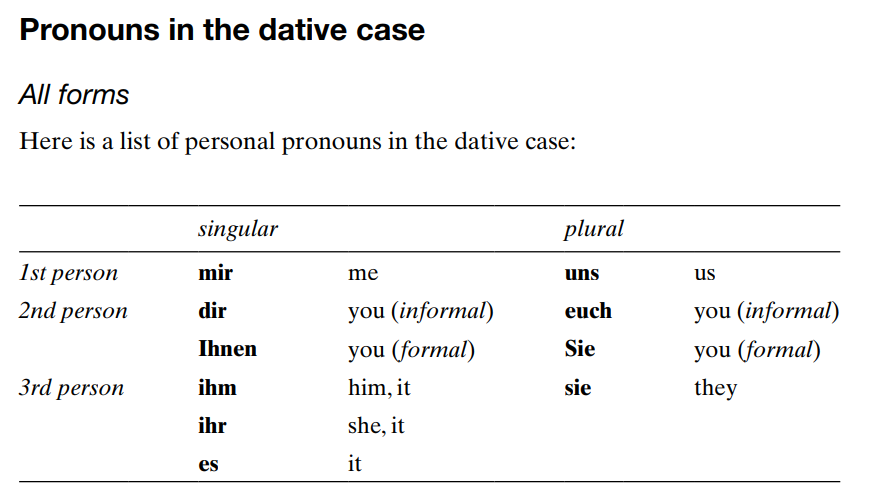

%Basic German 
%mzrxa
&nbsp;  

## Unit 3: Ver variations and irregular verbs

ich -e  
du -st  
er/sie/est -t  
wir -en  
ihr -t  
Sie -en  
sie -en  

### Exercise 3.1

**Arbeiten**  
ich arbeite  
du arbeitest  
Sie arbeiten  
er/sie/est arbeitet  
wir arbeiten  
ihr arbeitet  
Sie arbeiten  
sie arbeiten  

**Tanzen**  
ich tanze  
du tanzt  
Sie tanzen  
er/sie/es tanzt  
wir tanzen  
ihr tanzt  
Sie tanzen  
sie tanzen  

**Heissen**
ich heisse  
du heisst  
Sie heissen  
er/sie/es heisst  
wir heissen  
ihr heisst  
Sie heissen  
sie heissen  

**Reissen**
ich reise  
du reist  
Sie reisen  
er/sie/es reist  
wir reisen  
ihr reist  
Sie reisen  
sie resit  

**Googeln**  
ich goggle  
du googelst  
Sie googeln  
er/sie/es googelt  
wir googeln  
ihr googelt  
Sie googeln  
sie googelt  

### Exercise 3.2  

|Verb   |mark|Verb  |mark|Verb   |mark|Verb  |mark|
|:-----:|:--:|:----:|:--:|:-----:|:--:|:----:|:--:|
|bleiben|    |helfen| y  |schreiben|- |stehen|    |
|essen  |  y |kommen|    |schwimmen|  |tragen| y  |
|fahren |y   |nehmen|y   |sehen    | y|treffen| y-|
|geben  |y-  |lesen |y   |singen|  |trinken|y     |
|gehen  |    |schlafen|y |sprechen|y|waschen|  y- |

### Exercise 3.3  

1. Ich heisse Hans Homann. &rarr; Er heisst Hans Homann.
2. Ich komme aus Wien. &rarr; Er kommt aus Wien.
3. Ich arbeite bei Radio O24. &rarr; Er arbeitet bei Radio O24.
4. Ich esse zu Mittag meistens Sushi. &rarr; Er isst zu Mittag meistens Sushi.
5. Ich spreche natürlich Deutsch, aber auch Englisch und Spanisch. &rarr; Er spricht natürlich Deutsch, aber auch Englisch und Spanisch.
6. Ich lese gern Kriminalromane. &rarr; Er liest gern Kriminalromane.
7. Ich fahre auch gern Ski und schwimme viel. &rarr; Er fahrt auch gern Ski und schwimme viel.
8. Ich sehe gern Filme mit Michael Keaton. &rarr; Er sieht gern Filme mit Michael Keaton.
9. Ich schlafe oft lange. &rarr; Er schlaft oft lange.
10. Ich reise gern. &rarr; Er risst gerne.
11. Am Abend treffe ich oft Freunde im Kaffeehaus. &rarr; Am Abend trifft er oft Freunde im Kaffeehaus.
12. Am Wochenende helfe ich manchmal alten Leuten. &rarr; Am Wochenenden halft er manchmal alten Leuten.

### Exercise 3.4

1. She reads a book. &rarr; Sie liest ein Buch.
2. Peter speaks German and English. &rarr; Peter spricht Deutsch und Englisch.
3. We speak German and Spanish. &rarr; Wir sprachen Deutsch und Spanisch.
4. Magda likes eating pizza. &rarr; Magda möchte pizza essen.
5. I am meeting Nadine. &rarr; Ich treffe Nadine.
6. She is taking the underground. &rarr; Sie nimmt der untergrund.
7. He is wearing a T-shirt. &rarr; Er tragt ein T-shirt.

&nbsp;

## Unit 4: Irregular verbs: **haben** and **sein**

&nbsp;

### Summary

|       |haben  |sein   |
|:------|:-----:|:-----:|
|ich    |habe   |bin    |
|du     |hast   |bist   |
|Sie    |haben  |sind   |
|er/sie/es|hat  |ist    |
|wir    |haben  |sind   |
|ihr    |habt   |seid   |
|Sie    |haben  |sind   |
|sie    |haben  |sind   |

Ich haben viel gesunden &rarr; *I have sung a lot*  
Hunger haben &rarr; to be hungry &rarr; Ich habe Hunger.  
Durst haben &rarr; to be thirsty &rarr; Er hat Durst.  
Zeit haben &rarr; to be free/have time &rarr; Du hast Zeit.  
Glück haben &rarr; to be lucky &rarr; Sie haben Glück.  
Langeweile haben &rarr; to be bored &rarr; Wir haben Langeweile.  
Kopfschmerzen haben &rarr; to have a headache &rarr; Sie hat Kopfschmerzen.  

&nbsp;

### Exercise 4.1

&nbsp;

1. Hast du heute Abend Zeit?
2. Wir haben neue Nachbarn.
3. Er hat eine Schwester und einen Bruder.
4. Habt ihr etwas Geld?
5. Nadine hat ein neues Tablet.
6. Haben Sie ein Zimmer frei?
7. Ich habe Hunger.
8. Susanne und Frank ~~hat~~ haben eine neue Wohnung.

&nbsp;

### Exercise 4.2

&nbsp;

1. Sind Sie Engländer?          - Nein, ich bin aus Australien.
2. Bist du aus Deutschland?     - Ja, ich komme aus der Nähe bon Bonn.
3. Seid ihr aus München?        - Nein, wir sind aus Nürnberg.
4. Was ist Nele von Beruf       - Sie ~~sind~~ ist Designerin.
5. Was ~~machen~~ sind Katrin und Jan - Beide sind Studenten.
6. Was sind deine Hobbys?       - Mein Hobbys sind Musik und Computerspiele.
7. Wo bist du geboren?          - Ich bin in Düsseldorf geboren.
8. Wo seid ihr geboren?         - Wir sind beide in den USA geboren.

&nbsp;

### Exercise 4.3

&nbsp;

ich habe, du hast, Sie haben, er/sie/es hat, wir haben, ihr habt, Sie haben, sie haben.

ich bin, du bist, Sie sind, er/sie/es ist, wir sind, ihr seid, Sie sind, sie sind.

&nbsp;

### Exercise 4.4

&nbsp;

1. Wir sind aus New York.
2. Sie sind aus Australia.
3. Mario ist aus München.
4. Sind Sie Herr Becker?
5. Er hat eine Schwester.
6. Hast du Zeit? - Haben Sie Zeit?
7. Sie sind Studenten.
8. Ich habe ein Tablet.
9. Es ist Schwer.
10. Bonn ist in Deutschland und Salzburg is in Österreich.

&nbsp;

## UNIT 5 - Separable verbs in the present tense

&nbsp;

### Summary

&nbsp;

abfahren	-	to leave\
abholen		-	to pick up\
abwaschen	-	to do the washing up\
anfangen	-	to start\
ankommen	-	to arrive\
anrufen		-	to phone\
aufhören	-	to stop\
aufräumen	-	to tidy up\
aufstehen	-	to get up\
ausgehen	-	to get out\
ausschalten	-	to switch off\
einkaufen	-	to go shopping\
einladen	-	to invite\
einschlafen	-	to fall asleep\
fernsehen	-	to watch television\
mitbringen	-	to bring along\
mitkommen	-	to come along\
mitmachen	-	to join in\
stattfinden	-	to take place\
vorbereiten	-	to prepare\
sich vorstellen	-	to introduce oneself\
zumachen	-	to close\

&nbsp;

**Prefixes go at the end**

*When a sentence consists of **two main clauses**, the split-off prefix goes to the end of the releveant clause. **Not necessarily at the end of the sentence***

- anfrufen &rarr;       Herr Lobo ruft seine Frau an.
- aufstehen &rarr;      Nico steht um fünf Uhr morgens auf.
- ausgehen &rarr;       Yasmin geht jeden Tag aus.
- gernsehen &rarr;      Die Kinden sehen nicht viel fern.
- einkaufen &rarr;      Er kauft im Supermarkt ein.
- stattfinden &rarr;    Das Meeting findet am Montag statt.

|*clause 1*|*clause2*|  |
|:---------|:--------|:--|
|Ich stehe auf| un dann früstücke ich| I get up and then I have breakfast.|
| | | |
|Herr Carlsen sieht fern| aber seine Kinder lesen.| Mr Carlsen is watching television, but his children are reading|

&nbsp;

**Herr Schuster *schläft* erst um Mitternacht *ein*, aber er *steht* schon um fünf Uhr *auf***

**Verbs can have more than one prefix**

anmachen - to turn/switch on\
aufmachen - to open\
ausmachen - to turn/switch off\ 
mitmachen - to join in\
nachmachen - to imitate\
saubermacher - to clean\
weitermachen - to continue\
zumachen - to close\

&nbsp;

common separable prefixes:
- **ab- an- auf- aus- ein- mit- nach- vor- zu- zurück-**

some inseparable prefixes:
- **be- er- ge- ver-**

&nbsp;

### Exercise 5.1

&nbsp;

1. Jens *steht* um hab acht Uhr *auf*.
2. Er *fängt* seine Arbeit um neun Uhr *an*.
3. Mittags *ruft* er seine Freundin *an*.
4. Er *druckt* am Nachmittag viele Dokumente *aus*.
5. Um siebzehn Uhr *hört* er mit seiner Arbeit *auf*.
6. Nach der Arbeit *kauft* er im Supermarkt *ein*.
7. Abends *sieht* er manchmal *fern*.
8. Am Wochenende *geht* er oft *aus*.
9. Er *schläft* meistens *ein*. 

&nbsp;

### Exercise 5.2

&nbsp;

|aufstehen|s|verlieren|i|abfahren|s|anrufen|s|
|:--------|-|:--------|-|:-------|-|:------|-|
|verkaufen|i|fernsehen|s|anhängen|s|stattfinden|s|
|einladen|s|mitkommen|s|bezahlen|i|erzählen|i|
|aufräumen|s|früstücken|i|einkaufen|s|besuchen|i| 

&nbsp;

### Exercise 5.3

&nbsp;

1. Herr und Frau Nowitzki *stehen* um sieben Uhr *auf*.
2. Die Kinder *räumen* ihr Zimmer *auf*.
3. Er *kauft* immer im Supermarkt *ein*.
4. Wir gehen ins Café. *Kommst* du *mit*?
5. Wann ~~?!!?!?!~~ findet statt.
6. Herr Beckmann liebt TV-Serien. Er *sieht* jeden Tag *fehr*.
7. Wann *fährt* der nächste Zug nach Hamburg *ab*?
8. Wir *laden* viele Gäste zu unserer Party *ein*.
9. Philip *hängt* eine Datei *an*.
10. Sie hat ein neues Smartphone und ~~*rufen*~~ ruft ihre Freundin *an*.

&nbsp;

### Exercise 5.4

&nbsp;

1. Ich stehe um sechs Uhr auf.
2. Ich fange meine arbeit um acht Uhr an.
3. Das Treffen findet am Montag statt.
4. Wann fährt der Zug ab?
5. Wann kommt der Zug an?
6. Die Kinder sehen ~~fehr~~ fern.
7. Kommst du ~~an~~ mit?
8. Ich ~~stecke~~ hänge die Datei an und drucke ~~die~~ den Artikel auf.

### Checklist:

1. The first part the prefix
2. It goes to the very end of a sentence or clause
3. Seperable prefixes incluse ab-, an-, auf-, aus-, ein-, fern, mit-, statt-, vor-, zu-
4. In a good conventional dictionary it should say 'sep' after the main German entry
5. Non-separable prefixes include be-, er-, ge-, ven-

&nbsp;

## Unit 6 - Imperatives

&nbsp;

### Summary

&nbsp;

1. Du form:
    - stem of the verb without ending: komm-en &rarr; komm. Komm her!
    - irregular (du) form:
        - if stem end -d, -t, consonant+m or consonant+n add -e: warten &rarr; wart(+ -e) Warte!
        - stem vowel change = same vowel change in imp: sprechen &rarr; sprich. Sprich leise!
        - stem vowel change a to ä: do not change (use stem): fahren &rarr; fahr. Fahr rechts!
    - separable verbs:
        - prefix after the verb or end of clause: mitmmachen &rarr; mach...mit &rarr; Mach bitte mit.
    - haben and sein:
        - like regular verbs, form from the stem: hab-en &rarr; hab. Hab Geduld. Be patient. sei-n &rarr; sei. Sei vorichtig. Be careful.
2. One person formal - Sie form:
    - just use the infinitive (with Sie after verb): kommen &rarr; Kommen Sie, bitte.
    - separable verbs:
        - verbs split as before: anfangen &rarr; Fangen Sie bitte an. Please start.
    - haben and sein:
        - just infinitive, but extra e with **sein**: haben &rarr; Hbaen Sie Geduld (be patient). sein &rarr; Seien Sie vorsichtig (be careful).
3. More than one informally - Ihr form:
    - add -t to stem: also for haben:
        - even if -e because stem end -d, -t, consonant+m or consonant+n, add -t (-et)
        - sein &rarr; seid
        - separate verbs split prefix
4. More than one person formal - Sie form:
    - exactly like Sie singular

&nbsp;

### Exercise 6.1

1. Bringen Sie mir noch einen Safat, bitte.
2. Öffnen Sie bitte das Fenster.
3. Warten Sie bitte noch fünf Minuten.
4. Schicken Sie mir eine SMS.
5. Kommen Sie herein!
6. Fangen Sie an!
7. Seine Sie bitte ruhig. 
8. Haben Sie ein bisschen Geduld.

&nbsp;

### Exercise 6.2

&nbsp;

1. Bring du mir noch einen Safat, bitte.
2. Öffne du bitte das Fenster.
3. Warte du bitte noch fünf Minuten.
4. Schicke du mir eine SMS.
5. Komme du herein!
6. Fange du an!
7. Sei du bitte ruhig. 
8. Habe du ein bisschen Geduld.

&nbsp;

### Exercise 6.3

&nbsp;

1. Fahr mit dem Fahrrad.
2. Geh zu einem Yogakurs.
3. Sieh weniger fern. 
4. Ess meh Gemüse.
5. Lies einen Blog über Gesundheit.
6. Schläf mehr.
7. Sei relaxter.
8. Geh meh aus.
9. Finde eine bessere Work-Life-Balance.

&nbsp;

### Exercise 6.3

&nbsp;

1. Please start
    - Geh bitte aus
    - Gehen Sie bitte aus
    - Geht bitte aus
2. Open the window
    - Öff die fenster
    - Öffen Sie die fenster
    - Öfft die fenster
3. Send me a text message
    - Schick mir eine SMS 
    - Schicken Sie mir eine SMS
    - Schickt mir eine SMS
4. Be careful
    - Hab vorsichtig
    - Sei Sie vorsichtig
    - Seid vorsichtig

&nbsp;

### Checklist

&nbsp;

1. Du, Sie (one pers form), Ihr, Sie (multi form)
2. By removing the -en from the stem
3. Vowel change. Separable. Added -e?
4. !

&nbsp;

## Unit 7 - Questions

&nbsp;

### Summary

1. Wh-question: Woher kommen Sie?
    - wo? where
    - woher? where from
    - wohin? where to
    - wann? when
    - wie? how/what
    - wie lange? how long
    - wie viel? how much
    - wie viele? how many
    - wie oft? how often
    - warum? why
2. Y/N question: Ist das Ihr handy?

- wie for names and addresses

&nbsp;

### Exercise 7.1

&nbsp;

1. Wie heißen Sie?
2. Wo wohnen Sie?
3. Wie ist Ihre E-Mail-Adresse?
4. Wo arbeiten Sie?
5. ~~Wie~~ Was sind Sie von Beruf?
6. ~~Wo~~ Woher kommen Sie eigentlich?
7. Wie viel kostet das?
8. Wann beginnt der Workshop?
9. Wie viel Uhr ist es?
10. ~~Wann~~ Woher kommt der Tennisspieler?
11. Wohin fahren wir am Sonntag?
12. Wie viele Einwohner hat Deutschland?

&nbsp;

### Exercise 7.2

&nbsp;

1. Ist das Restaurant wirklich sehr billig?
2. Ist Leon wirklich verheiratet?
3. Macht Frau Weber wirklich viel Sport?
4. Kostet Das Smartphone wirklich nur 80 Euro?
5. Stehen Jennifer und Max wirklich um sechs Uhr auf?

&nbsp;

### Exercise 7.3

&nbsp;

1. ~~Wie heißt du?~~ Wie ist Ihr Name?
2. Was sind Sie von Beruf?
3. ~~Wann Sie die Arbeit anfangen?~~ Wann beginnt Ihre Arbeit?
4. ~~Möchten Sie die Arbeit?~~ Ist die Arbeit interessant?
5. Haben Sie Kinder?
6. Sind Sie verheiratet?
7. ~~Haben Sie Hobbys?~~ Was sind Ihre Hobby? 
8. Sprechen Sie Spanisch?

&nbsp;

### Exercise 7.4

&nbsp;

1. Was ist dein Name?
2. Woher kommst du?
3. Wie ist deine email address?
4. Wie spät ist es?
5. Bist du verheiratet?
6. Hast du Kinder?
7. Sprichst du Englisch?
8. Was magst du von Beruf?

&nbsp;

### Exercise 7.4

&nbsp;

1. Wie
2. First position
3. Second?
4. Woher Wohin

&nbsp;

## Unit 8 - Articles

&nbsp;

### Exercise 8.1

&nbsp;

1. Die Frau kommt aus Brasilien.
2. Die Idee ist wirklich gut.
3. Wie heißt der Junge.
4. Der Mann von Elena ist aus München.
5. Das Handy ist teuer.
6. Ist dies das Kind von Tim?
7. Der Sommer ist jetzt zu Ende.
8. Die Türkei ist schön.
10. Was machen das Kinder.

&nbsp;

### Exercise 8.2

&nbsp;

Der die das die ein eine ein -

&nbsp;

### Exercise 8.3

&nbsp;

1. Der Kaffee ist stark.
2. Das ist ein neues Computerspiel.
3. Canberra ist die Hauptstadt von Australien.
4. Ich möchte ein Bier und eine Cola, bitte.
5. Hannover ist die Stadt in Deutschland.
6. Das Restaurant ist sehr gut.

&nbsp;

### Exercise 8.4

&nbsp;

1. Die Frau kommt aus Berlin.
2. Der Kaffee ist lecker.
3. Das Kind ist sieben Jahre alt.
4. Die Kinder spielen Fußball.
5. Er ist Amerikaner.
6. Er ist ein Lehrer.
7. Das ist Die Brandenburg Tor. 
8. Frühling war Kalt.i

&nbsp;

## UNIT 9 - Nouns and Gender

&nbsp;

### Exercise 9.1

&nbsp;

1. Der Montag, Dienstag, Mittwoch, Sonntag
2. Der Audi, Ferrari, Nissan, Ford
3. Das Silber, Gold, Eisen, Kupfer
4. Die Rose, Tulpe, Sonnenblume
5. Die Tochter, Schwester, Mutter, Cousine
6. Der Sommer, Frühling, Herbst, Winter
7. Der Wodka, Champagner, Rotwein, Schnaps
8. Das Schwimmen, Essen, Tanzen, Joggen

&nbsp;

### Exercise 9.2

&nbsp;

|Noun|Gender|Noun|Gender|Noun|Gender|Noun|Gender|
|-|-|-|-|-|-|-|-|
|Bäckerei|f|Auto|n|Flasche|f|Temperatur|f|
|Lampe|f|Märchen|n|Metzgerei|f|Museum|n|
|Kirche|f|Emigration|f|Zentrum|n|Religion|f|
|Liberalismus|m|Nation|f|Demokratie|f|Instrument|n|
|Zeitung|f|Kino|n|Büro|n|Potenzial|n|
|Meinung|f|Honig|m|Universität|f|Motor|m|
|Karte|f|Optimismus|m|Mädchen|n|Natur|f|

&nbsp;

1. masculine:
    - male persons
    - days months
    - seasons
    - makers of cars
    - alcoholic drinks
2. feminine:
    - female persons
    - trees and flowers
    - names of motorbikes and ships
3. neuter:
    - young persons
    - names of hotels and cinemas
    - most metals
    - infinitives as nouns

&nbsp;

### Exercise 9.3

&nbsp;

1. Berlin ist eine fantastische Stadt
2. Das Hotel liegt sehr zentral.
3. Der Service ist ausgezeichnet und das Essen ist gut.
4. Die Woche geht so schnell vorbei.
5. Die Menschen in Berlin sind sehr freundlich.
6. Heute Abend gehen wir zuerst in ein Konzert und dann in ein Restaurant und feiern unseren letzten Tag in Berlin.
  
&nbsp;

### Exercise 9.4

&nbsp;

1. Das E Auto fährt sehr ökologisch.
2. Der Tisch und das Regal sind kaputt.
3. Die Tochter heißt Marina.
4. Die Rose ist sehr schön.
5. Die Karte kostet 10 Euro.
6. Die Jacke ist von Chanel.
7. Das Bier ist alkoholfrei.
8. Das Stadtzentrum ist sehr alt.
9. Ist der VW neu?
10. Das Mädchen ist elf Jahre alt und der Junge ist sieben.
11. Die Internetverbindung ist sehr langsam.
12. Die Grammatik ist manchmal schwer.

&nbsp;

## UNIT 10 - Plural of noun

&nbsp;

### Exercise 10.1

&nbsp;

1. die Messer
2. die Mäntel
3. die Bücher
4. die Kühlschränke
5. die Gläser
6. die Mütter
7. die Passwörter
8. die Regale
9. die Tassen
10. die Teppiche
11. die Zeitungen
12. die Zimmer

&nbsp;

### Exercise 10.2

&nbsp;

1. Die Tage
2. Die Kurse
3. Die Orangensäfte
4. Die Gäste
5. Die Schnäpse
6. Die Tassen
7. Die Meinungen
8. Die Städte
9. Die Bratwürste
10. Die Schiffe
11. Die Programme
12. Die Häuser
13. Die Bücher
14. Die Länder
15. Die Tomaten
16. Die Hotels
17. Die Blogs
18. Die Handys
19. Die Tweets
20. Die Sneakers

&nbsp;

### Exercise 10.3

&nbsp;

1. Masculine:
    . -e 
    . Umlaut +e
    . Some without ending
2. Feminine:
    . -en -n and sometimes -e 
    . Umlaut +e 
    . Some without ending
3. Neuter:
    . Umlaut +er
4. Foreign:
    . -s

&nbsp;

### Exercise 10.4

&nbsp;

1. Ich möchte zwei Flaschen, Bitte.
2. Zwei Würste, Bitte.
3. Die Äpfel sind zu süß.
4. Er hat zwei Schwestern und drei Brüder.
5. Sie liest drei Zeitungen.
6. Das Haus hat vier Zimmer.
7. Sie spricht fünf Sprachen.
8. Die Hause sind neu. 
9. Er hat drei Handys.
10. Die Partys sind immer interessant.

## UNIT 11 - The Four Case

&nbsp;

### Exercise 11.1

&nbsp;

. <ins>subject</ins>
. **accusative**
. _dative_ 

1. <ins>Der Mann</ins> geht ins Fitnesscenter.
2. <ins>Er</ins> kauft dem Mädchen ein Eis.
3. <ins>Herr Schulz</ins> zeigt dem Gast den Garten.
4. <ins>Der Kellner</ins> bringt dem Mann das Essen. 
5. Um acht Uhr verlässt <ins>die Nachbarin</ins> das Haus.
6. Nach dem Essen trinken <ins>die Leute</ins> noch Kaffee. 

&nbsp;

### Exercise 11.2

&nbsp;

1. Ich schenke _der Frau_ **ein Buch**.
2. Er kauft _dem Mädchen_ **ein Eid**.
3. Herr Schulz zeigt _dem Gast_ **den Garten**
4. Der Kellner bringt _dem Mann_ **das Essen**.

&nbsp;

### exercise 11.3

&nbsp;

||accusative||dative||genitive||
|-|-|-|-|-|-|-|-|
|masculine|einen|y|einem|y|eines|y|
|feminine|eine|n|einer|y|einer|y|
|neuter|ein|n|einem|y|einem|y|

&nbsp;

||accusative||dative||genitive||
|-|-|-|-|-|-|-|-|
|masculine|den|y|dem|y|des|y|
|feminine|die|n|der|y|der|y|
|neuter|das|n|dem|y|des|y|

&nbsp;

## UNIT 12 - The Nominative Case

&nbsp;

NB: Seinen and werden take the nominative too: Es wird **ein** schöner Tag.

&nbsp;

### Exercise 12.1

&nbsp;

1. Dies ist ein LED Fernseher. Der LED Fernseher kostet 400 Euro.
2. Dies ist ein  Auto. Das Auto ist ein VW.
3. Dies ist eine Zeitung. Die Zeitung heißt Die Welt.
4. Dies ist eine Flasche Bier. Die Flasche kommt aus München.
5. Dies ist ein Hotel. Das Hotel heißt Maritim.
6. Dies ist ein Supermarkt. Der Supermarkt heißt Aldi.
7. Dies sind Studenten. Die Studenten kommen aus Kanada.
8. Dies sind Trainers. Die Trainers sind neu.

&nbsp;

### Exercise 12.3

&nbsp;

1. Dies ist ein Haus.
2. Das Haus ist sehr alt.
3. Der Mann heißt Mario.

&nbsp;

## UNIT 13 - The Accusative Case

&nbsp;

. after most verbs
. after these prepositions:
    . bis until
    . durch through
    . für for
    . gegen 
    . ohne without
    . um 

&nbsp;

### Exercise 13.1

&nbsp;

1. ich brauche eine Lampe.
2. ich brauche eine Blumenvase.
3. ich brauche einen Küchentisch.
4. ich brauche ein Sofa.
5. ich brauche ein Bücherregal.
6. ich brauche einen Teppich.
7. ich brauche einen Kühlschrank.
8. ich brauche eine Mikrowelle.
9. ich brauche eine Kaffeemaschine.
10. ich brauche eine Waschmaschine.
11. ich brauche ein Handy.
12. ich brauche einen Camcorder.

&nbsp;

### Exercise 13.2

&nbsp;

1. Das Buch ist für einen Freund.
2. Das Sweatshirt ist für eine Freundin.
3. Die Sportschuhe sind für meine Schwester.
4. Die Socken sind für meinen Vater.
5. Die Lego-Spiele sind für das Kind.
6. Er ist gegen die Idee.
7. Ohne der Hund möchte er nicht in den Urlaub fahren.
8. Er möchte um das ganze Welt fahren.

&nbsp;

### Exercise 13.3

&nbsp;

1. Ich möchte einen Kaffee.
2. Der Mann kauft den Computer.
3. Die Frau kauft den Camcorder.
4. Das Kind liest das Buch.
5. Das Sweatshirt ist für mein Bruder.
6. Das Buch ist für meine Schwester.
7. Wir gehen durch den Park.
8. Ich brauche eine Kaffeemaschine und eine Mikrowelle.
9. Ich brauche einen Regenschirm.
10. Ich bin für die Idee.

&nbsp;

## UNIT 14 - The Dative Case

&nbsp;

&nbsp;

- dem der dem den 
- einem einer einem 
- meinem meiner meinem meinen
- keinem keiner keinem keinen

- antworten
- begegnen, to encounter
- helfen
- danken
- gehören, to belong to
- gratulieren
- folge, to follow
- trauen, to trust

- aus, from. Er kommt aus der Turkei.
- außer, apart from
- bei, at neat
- gegenüber, opposite. Er wohnt gegenüber der Kirche.
- mit, with by. Ich fahre mit dem Bus.
- nach, after to. Nach der Arbeit gehe ich einkaufen.
- seit, since for. Tim studiert seit einem Jahr.
- von, from
- zu, to. Wir fahren zu meiner Freundin.

&nbsp;

### Exercise 14.1

&nbsp;

1. Sie gibt dem Großvater ein Buch über Nelson Mandela.
2. Sie gibt der Mutter einen Strauß Blumen.
3. Sie gibt dem Vater eine Flasche Wein.
4. Sie gibt dem Sohn Star-Wars-Tasse.
5. Sie gibt der Tochter ein Haarband.
6. Sie gibt dem Baby einen Ball.

&nbsp;

### Exercise 14.2

&nbsp;

1. Er fährt jeden Tag mit dem Auto.
2. Gegenüber dem Rathaus ist der Stadtpark.
3. Sie kommt gerade aus der Stadt.
4. Den neuen Shop gibt es seit einem Jahr.
5. Vor einer Woche hat sie geheiratet,
6. Was machst du heute nach der Arbeit.
7. Sie wohnt bei dem Freund.
8. Er telefoniert mit dem Handy.
9. Sie hilft der Frau.
10. Das gehört dem Mann.
11. Er dankt den 20 Mitarbeitern.
12. Wir helfen den Kindern.

&nbsp;

### Exercise 14.3

&nbsp;

1. Sie gibt dem Baby ein Buch.
2. Paulina kauft dem Kind ein Eis.
3. Er gibt dem Großvater eine Flasche Wein.
4. Er folgt dem Mann.
5. Das iPad gehört dem Fahrer.
6. Peter hilft dem Mädchen.
7. Er gibt dem Kinder einen Ball.
8. Sie kommmt aus der Turkei.

&nbsp;

## UNIT 15 - The Genetive Case

&nbsp;

- masculine and neuter -es
- feminine -er
- one-syllable neuter and masculine nouns -es, longer ones add -s

- trotz, despite
- während, during
- wegen, because of
- (an)statt, instead of 

- Während seiner Zeit... During this time...
- Trotz ihres jungen Alters... Despite her young age...

&nbsp;

### Exercise 15.1

&nbsp;

1. Das ist das Mountainbike von meinem Sohn.
2. Das sind die Sportsachen von meiner Frau.
3. Das ist das Spielzeug von meinemm Kind.
4. Das ist die Frau von meinem Chef.
5. Da vorne steht der Scooter von meiner Schwester.
6. Die Lehrerin von der Englischkurse kommt aus New York.
7. Der Trainer von unserer Hockeymannschaft ist sehr gut.
8. Die Meinung von meiner Freunde ist mir sehr wichtig.

&nbsp;

### Exercise 15.2

&nbsp;

1. Das ist der Scooter meines Bruders.
2. Das ist das Auto meiner Schwester.
3. Diese sind die Freunde meiner Tochter.
4. Das ist Paulas Tasche.
5. Es war Tims Fehlentwicklung.

&nbsp;

## Unit 16 - Personal Pronouns

&nbsp;

- durch, through
- für
- gegen
- ohne
- um, around

&nbsp;

- außer, apart from
- aus, from
- bei, at, near
- gegenüber, opposite
- mit
- nach, after, to
- set, since, for
- zu, to

- danken
- gehören, to belong to
- antworten
- helfen
- folgen, to follow

&nbsp;

- The pronoun "man" - 'one, you', refers to people in general: 
  	- Man tut das nicht. You don't do that. One does not do that.
	- Man darf hier nicht fotografieren. You are not allowed to take photographs here.

&nbsp;

&nbsp;

### Did you know?

- Wie geht es dir/Ihnen/euch?
- Es geht mir gut. I am well.
- Es tut mir leid. I am sorry.
- Meine Nase/Mein Bein tut mir weh. My nose/My leg hurts.
- Mir ist kalt/heiß. I am cold/hot.
- Gefält fir/Ihnen das T-Shirt? Do you like the T-shirt?
- Können Sie mir sagen, vieviel Uhr es ist? Can you tell me what time it is?

&nbsp;

### Exercise 16.1

&nbsp;

1. Er kommt aus Bremen.
2. Sie hat einen neuen Freund.
3. Es ist neu.
4. Sie spielen im Park Fußball.
5. Sie waren teuer.
6. Sie kostet 7.50 Euro.
7. Sie hat einen schlechten Tag.
8. Es heißt Lena.
9. Er ist Ingenieur von Beruf.
10. Sie machen Urlaub in einem Wellnesshotel.

&nbsp;

### Exercise 16.2

&nbsp;

1. Ja, ich kaufe es.
2. Ja, ich kenne ihn.
3. Ja, ich kenne sie.
4. Ja, ich habe es.
5. Ja, ich trinke ihn.
6. Ja, ich möchte sie.
7. Ja, ich mag sie.
8. Ja, ich besuche dich.
9. Ja, ich besuch euch.
10. Ja, es geh mir gut.

&nbsp;

### Exercise 16.3

&nbsp;

1. Schenkst du Tina etwas? - Ja, ich schenke ihr Blumen.
2. Gefällt dir die Party? - Nein, die Party gefällt mir überhaupt nicht.
3. Kaufst du Matthias ein T-Shirt? - Nein, ich kaufe ihm eine Baseballmütze.
4. Hilfst du den Kindern? - Ja, ich helfe ihnen.
5. Kannst du mir helfen? - Ja, ich helfe dir.
6. Können Sie mir helfen? - Ja, ich helfe Ihnen.
7. Gehört das Ihnen? - Ja, es gehört mir.
8. Was bringst du denn Anna und Tina mit? - Ich kaufe ihnen eine Flasche Wein. 
9. Soll ich euch die Wohnung zeigen? - Ja, zeig sie uns, bitte.
10. Schickst du uns ein Selfie aus dem Urlaub? - Ja, ich schicke euch ein Selfie.

&nbsp;

### Exercise 16.4

&nbsp;

1. Der Kaffee ist gut. Es ist gut.
2. Die Jacke ist neu. Sie ist neu.
3. Ist es für mich?
4. Ich kaufe ihm eine Flasche Wein.
5. Er schickt ihr ein SMS.
6. Wie geht es dir? Wie geht es Ihnen.
7. Mir geht es gut.
8. Es tut mir leid.

&nbsp;

## Unit 17 - Possesive Adjective

&nbsp;

&nbsp;

### Exercise 17.1

&nbsp;

- my mein
- your (informal) dein
- your (formal) Ihr
- his sein
- her ihr
- its sein
- our unser
- your (informal) euer
- your (formal) Ihr
- their ihr

&nbsp;

### Exercise 17.2

&nbsp;

1. Wie ist dein Name? - Mein Name ist Frank Auerbach.
2. Wie ist deine Telefonnummer? - Meine Telefonnummer ist 888888.
3. Ist das sein Auto? - Nein, das ist ihr Auto.
4. Was sind Ihre Hobbys? - Meine Hobbys sind Joggen und Skifahren.
5. Was sind euer Namen? - Unsere Namen sind Svenja und Boris.
6. Sind das eure Sportsachen? - Ja, das sind unsere Sportsachen.

&nbsp;

### Exercise 17.3

&nbsp;

1. Tom sucht seine Brille.
2. Paula sucht ihr Geld.
3. Mehmet sucht seinen Controllen.
4. Marion sucht ihren Schal.
5. Martha sucht ihre SIM-Karte.
6. Benjamin sucht sein I-Pad.
7. Peter such seine Schuhe.
8. Jessica und Pia suchen ihre Pässe.

&nbsp;

### Exercise 17.4

&nbsp;

1. Das ist mein Vater.
2. Das ist meine Mutter.
3. Marc sucht seine SIM-Karte.
4. Susanne sucht ihren Führerschein.
5. Wir treffen unsere Freunde.
6. Sebastian spricht mit seiner Mutter.
7. Arianne spricht mit ihrem Bruder.
8. Die Kinder sprachen mit ihren Großeltern.

&nbsp;

## Unit 18 - Reflexive Verbs

&nbsp;

- sich amüsieren
- sich anziehen - to get dressed
- sich ärgern - to get or to be annoyed
- sich ausziehen - to get undressed
- sich bedanken - to say thank you
- sich beeilen - to hurry (up)
- sich duschen - to shower
- sich entscheiden - to decide
- sich entschuldigen - to apologise
- sich kämmen - to comb one's hair
- sich rasieren - to shave
- sich schminken - to put makeup
- sich setzen - to sit down
- sich treffen - to meet
- sich umziehen - to get changed
- sich unterhalten - to talk, chat
- sich verabschieden - to say goodbye
- sich vortsellen - to introduce onseself
- sich waschen - to wash oneself to have a wash

### Reflexive Pronouns - Akk

mich, dich, sich, uns, euch, sich

- Ich wasche mich
- Du wäschst dich
- Sie waschen sich
- er/sie/es Wäscht sich
- Wir waschen uns
- Ihr wascht euch
- Sie waschen sich
- Sie waschen sich

### Reflexive Pronouns (dativ)

- sometimes the pronoun is indirect object:
	- like when saying what clothes you are putting on
	- Ich ziehe mich an &rarr; Ich ziehe mir eine Jacke an
- only dativ example:
	- sich überlegen: to think something over
	- sich vornehmen: to intend to do
- pronouns dativ example:
	- Ich wasche mir die Haare
	- Du wäschst dir die Haare
	- Sie waschen sich die Haare
	- Er/Sie/Es wäscht sich die Haare
	- Wir waschen uns die Haare
	- Ihr wascht euch die Haare
	- Sie waschen sich die Haare
	- Sie waschen sich die Haare
- Sich,uns and euch are the same in dative and accusative
- Mich/Mir Dich/Dir differ

### Separable verbs

- When a verb is separable, the pronoouon tends to follow the ver and the prefix goes to the end of the sentence or the main clause:
	- anziehen &rarr; Ich ziehe mich an.
	- vorstellen &rarr; Er stellt sich dem Publikum vor. He introduces himself to the audience.

### Reflexive and non-reflexive verbs

- most can be used as non reflexive:
	- Ich wasche das Auto
	- Ich wasche mich
- Some only reflexive:
	- sich beeilen
	- sich bedanken

### Useful Expressions

- Wasch dir die Hände!		Wash your hands!
- Ich putze mir die Zähne.	I brush my teeth.
- Er putzt sich die Nase.	He blows his nose.
- Sie schminkt sich.		She puts on her make-up

### Exercise 18.1

&nbsp;

| amusieren | r | beeilen  | r | entscheiden   | r | einkaufen   | n |
| anziehen  | r | sudieren | n | entschuldigen | r | tanzen      | n |
| ausgehen  | n | duschen  | r | fahren        | n | unterhalten | r |
| ausziehen | n | arbeiten | n | kämmen        | r | waschen     | r |

&nbsp;

### Exercise 18.2

&nbsp;

1. Er entschuldigt sich bei seiner Freundin.
2. Das Kind kämmt sich nicht gern.
3. Ich ärgere mich über die Preise.
4. Ich ziehe mich um.
5. Anne zieht sich neues Kleid an.
6. Die Kinder waschen sich.
7. Die Spieler duschen sich nach dem Spiel.
8. Wir beeilen uns.
9. Wir treffen uns um acht Uhr.
10. Wir verabschieden uns.

&nbsp;

### Exercise 18.3

&nbsp;

1. Ich wasche mir die Hände.
2. Putzt du dir heute nicht die Zähne?
3. Zieh sich etwas Warmes an. Es ist kalt.
4. Ich wasche mir das Gesicht nur mit Wasser.

&nbsp;

### Exercise 18.4

&nbsp;

1. Ich dusche mich.
2. Ich putze mir die Zähne.
3. Ich ziehe mich an.
4. Ich kämme mich.
5. Ich ziehe mir eine Jacke.
6. Ich beeile mich.

&nbsp;

## UNIT 19 - Negatives

&nbsp;

### Exercise 19.1 

&nbsp;

1. Franziska joggt nicht.
2. Mario ist nicht clever.
3. Der film ist nicht interessant.
4. Das Wetter in England ist nicht gut.
5. Er fotografiert nicht gern.
6. Nadine macht nicht gern Outdoorsport.
7. Er fährt nicht gern mit seinem Mountainbike.
8. Monica kommt nicht aus Österreich.
9. Er ist nicht verheiratet.
10. Mia studiert nicht Medizin.
11. Sie geht heyte nicht ins Konzert.
12. Er spielt nicht gut Klavier.
13. Ich habe die App nicht gekauft.
14. Er hat die E-Mail nicht gelesen.

&nbsp;

### exercise 19.2

&nbsp;

1. Das Team hat kein Glück.
2. Sie hat keine Geduld.
3. Er hat im Moment kein Geld.
4. Elena hat keinen Bruder.
5. Ich habe keine Zeit.
6. Das ist kein Problem.
7. Er ist Veganer und isst kein Fleisch.

&nbsp;

### exercise 19.3

&nbsp;

1. Ist das ein Park? &rarr; Nein, das ist kein Park.
2. Ist das eine Kneipe? &rarr; Nein, das ist keine Kneipe.
3. Hast du ein Auto? &rarr; Nein, ich habe kein Auto.
4. Möchtest du einen Kaffee? &rarr; Nein ich möchte keinen Kaffee.
5. Nein, ich nehme keinen Nachtisch.
6. Nein, sie hat keine Schwester.
7. Nein, es hat keinen Wellnessbereich.
8. Nein, ich habe keine Geschwister.
9. Nein, ich habe keine Wanderschuhe.
10. Nein, Freiburg hat keine U-Bahn.
11. Nein, ich habe keine Zeit.

&nbsp;

### exercise 19.4

&nbsp;

1. Luke doesn't work. &rarr; Luke arbeitet nicht.
2. The hotel is not beautiful. &rarr; Das hotel ist nicht schön.
3. The tablet is not cheap. &rarr; Die Tablet ist nicht billig.
4. Paul doesn't have a mountain bike. &rarr; Paul hat kein Mountainbike.
5. They don't have a car. &rarr; Sie haben kein Auto.
6. This is not a good idea. &rarr; Das ist nicht eine gute Idee.
7. He hasn't got any time. &rarr; Er hat keine Zeit.
8. She doesn't live in London, but in New York. &rarr; Sie wohnt nicht in London, sondern in New York.
9. I don't drink coffee, but tea. &rarr; Ich trinke keinen Kaffee, Sondern Tee.
10. This is not a problem. &rarr; Das ist kein Problem.

&nbsp;

## UNIT 20 - Comparison of adjectives and adverbs

&nbsp;

### Summary

&nbsp;

- Comparative: Bigger, cheaper, more expensive
- Superlative: Biggest, cheapest, most expensive

- English comparative: -er or "more"
- English superlative: "the" -est or "the most"

#### Formation in German

- German comparative: add -er to the basic form (regardless of how long the adjective is):
	- billig	&rarr;		Dieser Laptop ist billiger
	- interessant 	&rarr;		London ist viel interessanter als Paris

- German superlative: add -sten to the adjective and put "am" before it, if the superlative comes after a noun:
	- billig	&rarr; 		Dieser Laptop ist am billigsten

#### The comparative in detail

- Adding -er:
	- klein		&rarr;		kleiner
	- cool		&rarr;		cooler
	- schnell	&rarr;		schneller
	- hässlich	&rarr;		hässlicher
	- langweilig	&rarr;		langweiliger
	- ökologisch	&rarr;		öokologischer
- Adding umlaut + -er:
- most short adjectives with the stem vowel a, o or u also add an umlaut
	- alt		&rarr;		älter
	- arm [poor]	&rarr;		ärmer
	- jung		&rarr;		jünger
	- groß		&rarr;		größer
	- kalt		&rarr;		kälter
	- lang		&rarr;		länger
	- stark [strong] &rarr;		stärker
	- warm		&rarr;		wärmer;
	- Exception:
		- flach		&rarr;		flacher
		- klar		&rarr;		klarer
		- voll		&rarr;		voller
		- gesund	&rarr;		gesünder
- Irregular forms:
	- gut		&rarr;		besser
	- hoch		&rarr;		höher
	- if -er -el drop e in comparative:
		- teuer		&rarr;		teurer
		- dunkel	&rarr;		dunkler
- Hoow to say 'than' als:
	- Berlin ist größer als München
	- Der Rhein ist länger als die Donau

#### The superlative in more detail

- Adding -sten:
	- The superlative is formed by adding -sten preceded by am
	- klein		&rarr;		am kleinsten
	- cool		&rarr;		am coolsten
	- schnell	&rarr;		am schnellsten
	- hässlich	&rarr;		am hässlichsten
	- langweilig	&rarr;		am langweiligsten
	- ökologisch	&rarr;		am ökologischsten
- Adding umlaut + -sten:
	- most monosyllabic adjectives with stem vowel a, o, u add umlaut
	- jung		&rarr;		am jüngsten
	- groß		&rarr;		am größten
	- lang		&rarr;		am längsten
	- warm		&rarr;		am wärmsten
	- Exception:
		- flach		&rarr;		am flachsten
		- klar		&rarr;		am klarsten
		- voll		&rarr;		am vollsten
- Irregular forms:
	- gut		&rarr;		am besten
	- nah		&rarr;		am nächsten [the closest]
	- hoch		&rarr;		am höchsten
	- -er -el keep the e:
		- teuer		&rarr;		am teuersten
		- dunkel	&rarr;		am dinkelsten
- Adjectives ending in -d, -t, -s, -z:
	- usually add extra e before -sten
	- kalt		&rarr;		am kältesten
	- kurz		&rarr;		am kürzesten
	- gesund	&rarr;		am gesündesten
	- interessant	&rarr;		am interessantesten

#### Comparative and superlative with adverbs

- Adverbs in German:
	- In English add -ly beautifully
	- In German most have the same form as adjectives

- Hana läuft langsam. &rarr; Kira läuft langsamer. &rarr; Paula läuft am langsamsten.
- Timo singt schlecht. &rarr; Sascha singt schlechter. &rarr; Jan singt am schlechtesten.
- Das Hardcover kostet wenig. &rarr; Das Paperback kostet weniger. &rarr; Das E-Book kostet am wenigsten.

- Using gern and viel:
	- Ich trike gern Wasser. &rarr; Ich trinke lieber Kaffee. &rarr; Ich trinke am liebsten Bier.
	- Björn twittert viel. &rarr; Rania twittert mehr. &rarr; Axel twittert am meisten [the most].

- NB:
	- The examples in this unit relate to comparative and superlative forms FOLLOWING nouns. These forms may change endings when they appear BEFORE a noun.

- Did you know:
	- another way of making comparison "so ... wie" [as ... as]
	- Er ist so kalt wie gestern:
		- It is as cold as yesterday
	- Er ist so groß wie sein Bruder:
		- He is as tall as his brother
	- Der Film ist so gut wie das Buch:
		- The film is as good as the book

&nbsp;

### Exercise 20.1

&nbsp;

|                  | comparative         | superlative             |
| klein            | kleiner             | am kleinsten            |
| langweilig       | langweiliger        | am langweiligsten       |
| alt              | älter               | am ältesten             |
| groß             | größer              | am größten              |
| hoch             | höher               | am höchsten             |
| interessant      | interessanter       | am interessantesten     |
| intelligent      | intelligenter       | am intelligentesten     |
| umweltfreundlich | umweltfreundlichter | am umweltfreundlichsten |
| gut              | besser              | am bestern              |
| gern             | lieber              | am liebsten             |
| viel             | mehr                | am miesten              |

&nbsp;

### Exercise 20.2

&nbsp;

1. Ist der Rhein wirklich länger als die Donau?
2. Norddeutschland ist flacher als Süddeutschland.
3. Der Zug ist billiger als das Flugzeug.
4. Ist das I-Pad teurer als das I-Phone?
5. Ich finde das Buch interessanter als den Film.
6. Die neue Castingshow ist langweiliger als die alte.
7. Auf dem Land ist es ruhiger als in der Stadt.
8. Heute ist es kälter als gestern.
9. Das neue Modell ist am ökologischer.
10. Er lebt jetzt gesünder als früher.
11. Welcher Berg in Österreich ist am höchsten?
12. Welche Musik hörst du am liebsten?
13. Welches Auto ist am umweltfreundlichsten?
14. Dieser Club ist im Moment am coolsten.
15. Diese Pizza schmekt am bestern.

&nbsp;

### Exercise 20.3

&nbsp;

1. München ist groß:
	1. Hamburg ist größer
	2. Berlin ist am größten
2. Die Donau ist lang:
	1. Die Elbe ist länger
	2. Der Rhein ist am längsten
3. Salat schmeckt gut:
	1. Pasta schmeckt besser
	2. Pizza schmeckt am besten
4. Tim spricht klar:
	1. Jan spricht klarer
	2. Anna spricht am klarsten
5. Susanne macht viel Sport:
	1. Nele macht mehr Sport
	2. Anke macht meisten Sport
6. Ich trinke gern Kaffee:
	1. Ich trinke lieber grünen Tee
	2. Ich trinke am liebsten schwarzen Tee
7. Portugiesisch ist kompliziert:
	1. Ungarisch ist komplizierter
	2. Chinesisch ist am kompliziertesten
8. Frankfurt ist multikulturell:
	1. Hamburg ist multikultureller
	2. Berlin ist am multikulturellsten

&nbsp;

### Exercise 20.4

&nbsp;

1. London ist größer als Paris
2. Der Rhein ist länger als die Donau
3. Jan ist älter als Gabriel
4. Boris ist intelligenter las Moritz
5. Hannah ist am intelligentesten
6. Der Zug ist ökologischer als das Flugzeug
7. Das Buch ist besser als der Film
8. Tim ist so groß wie sein Bruder
9. Diese Pizza schmeckt am besten

- Checklist:
	- -er als
	- am -sten
	- same
	- most monosyllabic
	- if superlative -d -t -s -z then add -e
&nbsp;

## UNIT 21 - Modal Verbs

&nbsp;

### Summary

&nbsp;

- The six modal verbs:
	- dürfen		may, to be allowed
	- können		can, to be able to
	- müssen		must, to have to
	- sollen		should, to be supposed to, ought to
	- wollen		to want to
	- mögen			to like
- All are quite irregular and often have a stem vowel change in the present tense
-

